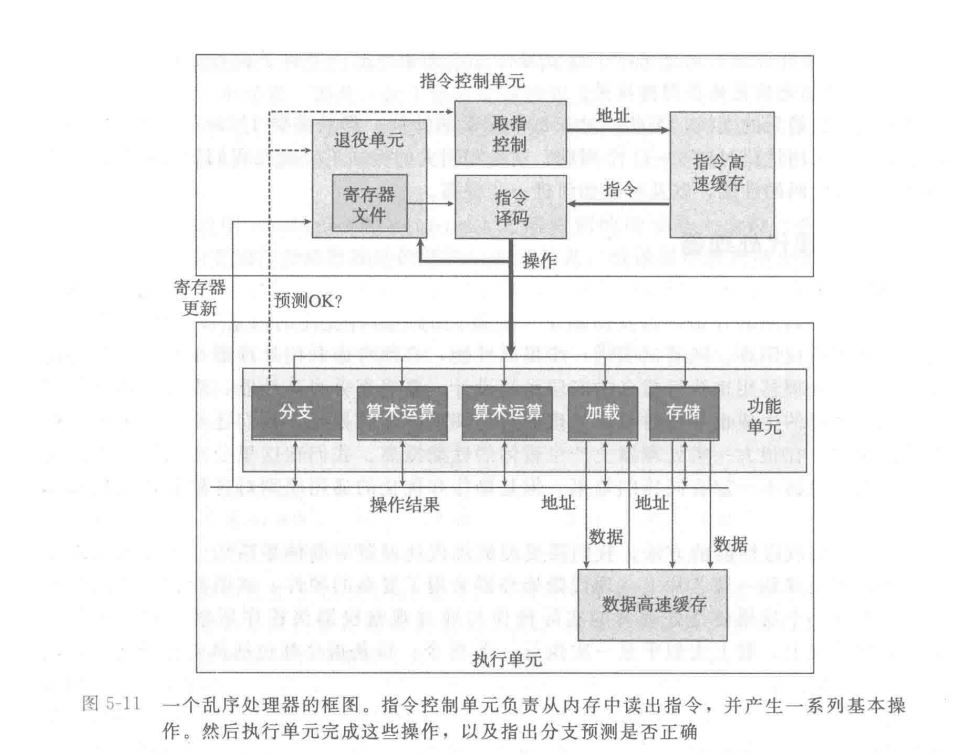

<!-- START doctoc generated TOC please keep comment here to allow auto update -->
<!-- DON'T EDIT THIS SECTION, INSTEAD RE-RUN doctoc TO UPDATE -->
**Table of Contents**  *generated with [DocToc](https://github.com/thlorenz/doctoc)*

- [第五章：优化程序性能](#%E7%AC%AC%E4%BA%94%E7%AB%A0%E4%BC%98%E5%8C%96%E7%A8%8B%E5%BA%8F%E6%80%A7%E8%83%BD)
  - [5.1 编译器优化的能力和局限](#51-%E7%BC%96%E8%AF%91%E5%99%A8%E4%BC%98%E5%8C%96%E7%9A%84%E8%83%BD%E5%8A%9B%E5%92%8C%E5%B1%80%E9%99%90)
  - [5.2 表示程序性能](#52-%E8%A1%A8%E7%A4%BA%E7%A8%8B%E5%BA%8F%E6%80%A7%E8%83%BD)
  - [5.3 程序示例](#53-%E7%A8%8B%E5%BA%8F%E7%A4%BA%E4%BE%8B)
  - [5.4 消除循环的低效率](#54-%E6%B6%88%E9%99%A4%E5%BE%AA%E7%8E%AF%E7%9A%84%E4%BD%8E%E6%95%88%E7%8E%87)
  - [5.5 减少过程调用](#55-%E5%87%8F%E5%B0%91%E8%BF%87%E7%A8%8B%E8%B0%83%E7%94%A8)
  - [5.6 消除不必要的内存引用](#56-%E6%B6%88%E9%99%A4%E4%B8%8D%E5%BF%85%E8%A6%81%E7%9A%84%E5%86%85%E5%AD%98%E5%BC%95%E7%94%A8)
  - [5.7 理解现代处理器](#57-%E7%90%86%E8%A7%A3%E7%8E%B0%E4%BB%A3%E5%A4%84%E7%90%86%E5%99%A8)
    - [整体操作](#%E6%95%B4%E4%BD%93%E6%93%8D%E4%BD%9C)
    - [功能单元的性能](#%E5%8A%9F%E8%83%BD%E5%8D%95%E5%85%83%E7%9A%84%E6%80%A7%E8%83%BD)
    - [处理器操作的抽象模型](#%E5%A4%84%E7%90%86%E5%99%A8%E6%93%8D%E4%BD%9C%E7%9A%84%E6%8A%BD%E8%B1%A1%E6%A8%A1%E5%9E%8B)
  - [5.8 循环展开](#58-%E5%BE%AA%E7%8E%AF%E5%B1%95%E5%BC%80)
  - [5.9 提高并行性](#59-%E6%8F%90%E9%AB%98%E5%B9%B6%E8%A1%8C%E6%80%A7)
  - [5.10 优化合并代码的结果小结](#510-%E4%BC%98%E5%8C%96%E5%90%88%E5%B9%B6%E4%BB%A3%E7%A0%81%E7%9A%84%E7%BB%93%E6%9E%9C%E5%B0%8F%E7%BB%93)
  - [5.11 一些限制因素](#511-%E4%B8%80%E4%BA%9B%E9%99%90%E5%88%B6%E5%9B%A0%E7%B4%A0)
  - [5.12 理解内存性能](#512-%E7%90%86%E8%A7%A3%E5%86%85%E5%AD%98%E6%80%A7%E8%83%BD)
  - [5.13 应用：性能提高技术](#513-%E5%BA%94%E7%94%A8%E6%80%A7%E8%83%BD%E6%8F%90%E9%AB%98%E6%8A%80%E6%9C%AF)
  - [5.14 确认和消除性能瓶颈](#514-%E7%A1%AE%E8%AE%A4%E5%92%8C%E6%B6%88%E9%99%A4%E6%80%A7%E8%83%BD%E7%93%B6%E9%A2%88)

<!-- END doctoc generated TOC please keep comment here to allow auto update -->

# 第五章：优化程序性能

关于程序的性能优化：
- 首先优化程序性能的前提一定是程序要正确执行。
- 某些时候程序对性能会有要求，比如要求实时处理的程序，如果性能不够那么程序就是不可用的。
- 对于运算量非常大需要按小时按天来计算运行时间的程序，即使20%的性能优化都会带来显著的改善。
- 编写高效的程序需要注意几点：
    - 选择适当的算法和数据结构。
    - 编写出编译器能够有效优化以转化为高效可执行代码的源码。
    - 在特定场景中，针对运算量特别大但是可以划分成多个部分，并且这些部分在多核、多处理器上并行执行的程序也可以优化程序性能。并发编程将在第12章介绍。
- 第一点是数据结构与算法的内容，这里不讨论。
- 理解第二点的前提是理解编译器的能力和局限性。
- 代码性能优化通常都会降低代码的可维护性和可读性等，我们需要在性能和可维护性之间做出平衡。
- 所以通常来说代码具体细节的优化都是在功能完成之后才进行的。（过早优化是万恶之源！）
- 现代的编译器已经具备各种各样的措施来优化代码，以产生高效的机器代码。
- 但即使最好的编译器也会受到妨碍优化的因素（optimization blocker）的阻碍。
- 程序员必须了解到这些东西，并编写容易优化的代码，这便是本章的主题。

本章主题：
- 了解机器的抽象模型，形象化处理器对执行的执行过程，并利用它来预测程序性能。
- 利用处理器提供的指令级并行，同时执行多条指令，通过降低一个计算不同部分的数据相关，增加并行度。
- 使用代码剖析程序，测量程序各个部分的性能，帮助优化现实中的大型程序。

## 5.1 编译器优化的能力和局限

现代编译器已经具备非常强大的优化能力：
- 但是某些优化只有在特定场景中才有用，某些时候我们不希望优化（典型情况：调试模式）。
- 编译器通常会向用户提供对它们所使用优化的控制，最简单的控制是指定优化级别，在使用gcc时，可以指定优化级别为`-Og -O1 -O2 -O3`，每个选项都是一系列优化选项的组合，从前往后一次增多。
- 编译器必须非常小心地对程序只使用**安全**的优化。也就是说必须在所有情况下，优化后程序都能和优化前得到同样的结果。
- 例子：
```C
void p343_twiddle1(long *xp, long *yp)
{
    *xp += *yp;
    *xp += *yp;
}

void p343_twiddle2(long *xp, long *yp)
{
    *xp += 2 * *yp;
}
```
- 虽然看起来这两个函数等价，但是需要考虑`xp yp`指向同一位置的情况，此时他们就不等价了，所以无论再高的优化等价前者都没有被优化为后者。
- 他们的汇编都是：
```x86asm
p343_twiddle1:
	movq	(%rsi), %rax
	addq	(%rdi), %rax
	movq	%rax, (%rdi)
	addq	(%rsi), %rax
	movq	%rax, (%rdi)
	ret
p343_twiddle2:
	movq	(%rsi), %rax
	addq	%rax, %rax
	addq	%rax, (%rdi)
	ret
```
- 这种两个指针可能指向同一位置的情况称为**内存别名使用**（memory aliasing）。在只执行安全的优化中，编译器必须假设不同指针可能指向同一内存。
- 这严重妨碍了编译器的优化，除非我们提供更多的信息和假定，不然编译器不会进行不安全的优化。即使这两个指针在程序中不可能指向相同地址，即使这种优化在语义上是安全的，但编译器也不会知道。
- 考虑下一种情况：
```C
long p343_f();
long p343_func1()
{
    return p343_f() + p343_f() + p343_f() + p343_f();
}
long p343_func2()
{
    return 4 * p343_f();
}
```
- 即使`-O3`也不会将前者优化为后者，因为编译器不知道调用的`p343_f`是否存在副作用，如果存在副作用，那么两者就是不等价的。
- 但是如果在声明时提供定义：
```C
long p343_f()
{
    return 1;
}
```
- 那么编译器就会知道这个函数不会有副作用，那么甚至能免去计算，直接返回结果。
```x86asm
p343_f:
	movl	$1, %eax
	ret
p343_func1:
	movl	$4, %eax
	ret
p343_func2:
	movl	$4, %eax
	ret
```
- 在编译期不知道优化所需要的信息时，总是会假定最糟的情况，才去最保守的策略，提供肯定不会出错的编译结果。
    - 所以不要总是说编译器为什么连XX这么简单的情况都不能优化了，分析编译器为什么要这么做，也许你在第一层，而编译器在第五层。当然编译器能力再强都是有限的，所以确实可能出现它在第一层的情况。
- 所以是否知道函数的定义也会影响编译期的优化，编译器的各种细节优化不胜枚举，这样的因素还有很多。我们需要尽可能了解它们以编写出编译器能够更好优化的程序。

## 5.2 表示程序性能

这里引入度量标准——每元素的周期数（Cycles Per Element，CPE），作为表示程序性能的指标。
- 周期表示时钟周期，比如在4GHz的CPU上，一个时钟周期就是0.25ns。
- 这里并不用整个程序运行时间，而是用每个元素的运行周期数。因为通常的算法在一系列元素上的操作。
- 在不同的元素数量上运行算法之后，使用最小二乘法做一个线性拟合，斜率即是每个元素的运行周期数。

## 5.3 程序示例

程序示例略。
- 试验与优化的方法；反复尝试不同方法，进行测量，并检查汇编代码表示以确定底层的性能瓶颈。
- 度量标准依然是CPE。

## 5.4 消除循环的低效率

优化循环内代码的手段：
- 将每轮循环都相同的计算移到循环外。由于编译器会非常谨慎，不是每次都会进行这种优化，所有某些时候也需要程序员自己手动来移动。
    - 典型例子：循环的终止条件使用`strlen`来计算，并且长度不会在循环中改变，那么最好移动循环外计算。
- 这样的例子非常常见，一个成熟的程序员应该在写每个算法时都估计出其时间复杂度，并尝试优化到最佳。而更具体的不影响复杂度的优化则可以留到以后来做。

## 5.5 减少过程调用

某些循环内的反复的简单函数调用可能会成为性能瓶颈，这时候使用内联函数，或者直接在循环内展开函数内容可能获得客观优化。

## 5.6 消除不必要的内存引用

在循环内部，应尽量消除不必要的内存引用：
- 比如每次循环取出内存位置的值进行计算后写回。
- 寄存器存取比内存存取更快，如果使用临时变量并且可以存放到寄存器中的话，效率会高很多。
- 由于可能的内存别名，编译器可能不会优化这种内存存取，所以使用临时变量是有意义的。
- 例子：
```C
void p355_f1(int *p, int *a, int n)
{
    for (int i = 0; i < n; ++i)
    {
        *p *= a[i];
    }
}
void p355_f2(int *p, int *a, int n)
{
    int res = *p;
    for (int i = 0; i < n; ++i)
    {
        res *= a[i];
    }
    *p = res;
}
```
- 汇编：
```x86asm
p355_f1:
	testl	%edx, %edx
	jle	.L7
	movq	%rsi, %rax
	movslq	%edx, %rdx
	leaq	(%rsi,%rdx,4), %rcx
.L9:
	movl	(%rdi), %edx      ; read memory in every loop
	imull	(%rax), %edx
	movl	%edx, (%rdi)      ; write memory in every loop
	addq	$4, %rax
	cmpq	%rcx, %rax
	jne	.L9
.L7:
	ret
p355_f2:
	movl	(%rdi), %ecx      ; res in %ecx
	testl	%edx, %edx
	jle	.L12
	movq	%rsi, %rax
	movslq	%edx, %rdx
	leaq	(%rsi,%rdx,4), %rdx
.L13:
	imull	(%rax), %ecx    ; only write register in every loop
	addq	$4, %rax
	cmpq	%rdx, %rax
	jne	.L13
.L12:
	movl	%ecx, (%rdi)
	ret
```

## 5.7 理解现代处理器

前面提到的优化仅仅是消除了妨碍编译器优化的因素，这些优化都不依赖于目标机器的特性：
- 随着进一步地优化，我们需要考虑处理器微体系结构的优化，也就是考虑处理器用来执行指令的底层系统设计。
- 这种优化不一定在所有机器上都适用，但是所有处理器体系结构上优化的道理是相同，但是优化的细节可能不同。
- 现代处理器提供了一个看起来是指令顺序执行的模型，但是实际上现代处理器普遍采用了乱序发射、流水线等指令级并行的设计，某些设计中，同时甚至可能有100多条指令同时执行。处理器采用一系列精细的机制保证执行结果与顺序语义模型完全一致。
- 在工业界中，将（平均）一个周期内可以执行多条指令的处理器成为超标量处理器，（注意不是向量处理器，向量处理器指的是SIMD这种数据级并行，现代处理器大多有向量指令集，这里不做讨论）。

### 整体操作


现代微处理器的模型：
- 有两个部分组成：指令控制单元（Instruction Control Unit，ICU），和执行单元（Execution Unit，EU）。
- 指令控制单元从指令高速缓存读取指令，进行指令译码后把操作发送给执行单元。当程序遇到分支时，现代处理器会采用分支预测技术，取出可能的下一条指令进行执行。分支预测在指令控制单元的取指控制模块中完成。
- 指令译码接收实际的程序指令，将他们转换为一组基本操作（也称之为微操作、微指令）。每个微操作完成某个简单的计算任务：例如两数相加，从内存读数据，将数据写回内存等。在复杂指令集比如X86-64中，一条指令可以被翻译为多条微操作。
- EU接受来自取指单元的操作，通常每个时钟周期接收多条操作，这些操作被分派到一组功能单元中，他们会执行实际的操作。
- 其中加载和存储单元负责读写内存，他们通过数据高速缓存来访问内存。
- 使用投机执行技术来执行指令时（也就是他们是通过分支预测来执行的，并不一定会被执行），最终结果不会被存放到寄存器或者数据内存中，直到处理器能够确定确实是走这个分支。如果不是走这个分支，那么结果会被丢弃。
- 分支操作也会被送到EU，用以确定分支预测是否正确。预测错误会丢弃结果，导致很大的性能开销。
- 还有名为算术运算的单元用来执行整数、浮点数的算术运算。
- ICU中，还有名为退役单元（retirement unit）的单元记录着正在进行的处理，并确保他们遵守机器程序的顺序语义。
    - 一旦一条指令完成运行，而且引起这条指令的分支点被确认为预测正确，那么这条指令就退役了。所有对寄存器的更新也就可以实际执行了。
    - 另一方面如果引起这条指令的分支点预测错误，那么这条指令被清空，丢弃所有计算结果。
    - 任何对程序寄存器的更新只有在退役时才会发生。但是指令间可能会有数据依赖，所以为了加速一条指令到另一条的结果的传送，许多此类信息是在执行单元之间发生交换的。而不需要指令结束后才发生。【这是上一节处理器设计中数据转发技术的更精细版本】

### 功能单元的性能

功能单元：
- 在算术运算单元中，有各种各样的计算单元：整数乘法、加法、除法，浮点数乘法、加法、乘法。
- 我们用两个指标来刻画一个计算单元完成计算的总时间：
    - **延迟**（latency）：完成计算所需总时间。
    - **发射时间**（issue time）：两个连续的同类型运算之间需要的最小周期数。
- 总体来说整数运算快于浮点运算，并且无论整数还是浮点，他们的加法、乘法数倍快于除法操作。
- 凭借流水线结构，发射时间可能快于延迟。如果没有流水线结构，那么发射时间和延迟相等。
- 在处理器中每种计算单元可能存在多套，它们可以同时执行，称之计算单元的**容量**。
- 表示发射时间的一种更常见方法是这个功能单元的**吞吐量**，定义为**容量/发射时间**，吞吐量越大，平均单位时间能进行的该运算越多。
- 对于特定的CPU来说，计算单元能够使用的硬件电路资源是有限的，怎么分配各种计算单元就非常讲究。为了获得整体的最优性能，让每个计算单元都能最大化利用，CPU设计者必须小心平衡功能单元的数量和他们各自的性能。一般会评估许多不同的基准程序，将大多数资源用于最关键的操作。
- 一般来说是整数乘法、浮点乘法和加法分配资源更多，除法相对来说用得更少一些。
- 根据吞吐量可以得到一个程序的理论CPE界限（越低性能越高，所以是下限），原理上来说，这个值是理论最优值，现实中无论如何优化，都只能接近而不能达到或者超过这个界限。（这里暂不考虑向量指令）。

### 处理器操作的抽象模型

从机器代码到数据流图：
- 对于每一个汇编程序，我们都可以绘制出一个数据流图表示其中数据的流动和依赖关系。不同操作之间的数据相关将会限制他们的执行顺序，这些限制最终可以抽象为一条**关键路径**（critical path），这是执行一组机器指令所需周期数的一个下界。
- 在优化时只有降低这条关键路径上的执行周期数才可能真正优化程序性能。
- 至于具体的优化细节，则因具体程序而已。
- 数据流图只是一种分析手法，并不是形式化的描述。

其他性能因素：
- 数据流中的关键路径只是指明了一个执行周期数的下界（性能的上界），现实中的代码执行是否能到达这个下界则不一定。
- 还会受制于计算单元数量、吞吐量等影响因素影响。

优化程序性能：
- 通过变化程序结构，降低关键路径的运行周期数，增强指令级并行，可以使执行的CPE接近理论CPE界限。

## 5.8 循环展开

循环展开是一种程序变换，通过增加每次迭代计算的元素数量，减少循环的迭代次数，降低分支预测失败带来的消耗。

## 5.9 提高并行性

现代处理器拥有很高的指令级并行，通过减少指令间相关性，就可以达到更大程度的指令级并行。

具体手段：
- **多个累积变量**：对于一个可结合和可交换的操作来说，比如整数加法和乘法，可以通过将一组合并运算分割为多个不同部分，最后再合并结果提高性能。比如说循环中计算`acc = a[i] * b[i] + c[i] * d[i]`，那么可以拆分为`acc0 = a[i] * b[i], acc1 = c[i] * d[i]`，最后结果为`acc0 + acc1`，就可以减少数据相关性，降低了指令数量，提高指令并行度。
- **重新结合变换**：例子循环中的`acc = acc * data[i] * data[i+1]`修改为`acc = acc * (data[i] * data[i+1])`，注意将`i`和`i+1`放到一轮循环中是因为循环展开。这看起来没有变化，但是先计算`data[i] * data[i+1]`降低了循环变量`i`的数据相关链的长度。
- **使用向量指令**：在x86-64指令集中，使用MMX/SSE/AVX等SIMD指令集来在一条指令上操作一组多个数据，从而提高吞吐量。不过不是所有程序都能使用SIMD指令加速。

## 5.10 优化合并代码的结果小结

略。

## 5.11 一些限制因素

除了上面的正面优化思路，还有一些问题会限制程序性能：
- 寄存器溢出：如果寄存器的使用超过了可用的寄存器数量，就会出现寄存器溢出，导致新的临时值无寄存器可用，通常他们会被放到栈上，相比起来性能会下降很多。
- 分支预测惩罚：当分支预测逻辑不能正确预测一个分支是否要跳转时，会有可观的性能惩罚。
    - 不需要过分关系分支预测惩罚：现代处理器都比较复杂，预测成功的概率比较大。
    - 编写适用于条件传送的代码：可以直接消除分支预测失败带来的可能的惩罚。

## 5.12 理解内存性能

下一章将会详述。

## 5.13 应用：性能提高技术

总结，优化程序的基本策略：
- 高级设计：为问题选择合适的算法与数据结构，避免使用糟糕复杂度的算法和数据结构。
- 基本编码原则：避免限制优化的因素，这样编译器才能产生高效的代码。
    - 消除连续的函数调用：可能时将函数移到循环外。
    - 消除不必要的内存引用：引入临时变量保存中间结果，计算完成后才写回结果中。
- 低级优化：结构化代码以利用硬件功能。
    - 展开循环。
    - 多个累积变量、重新结合等技术，提高指令级并行的方法。
    - 用功能性风格编写条件操作，使得编译器可以使用条件传送指令。
- 通常来说，高级设计是首要的必须要考虑的事情，基本编码原则则可以在长期实践中加以注意，低级优化则在编码中并不需要太过关心，最多用在系统性能瓶颈代码的优化中。
- 最后的最后：一定注意，性能优化的前提一定是程序保持正确性，不要因为性能优化引入错误。使用单元测试测试确保优化前优化后功能未发生改变！

## 5.14 确认和消除性能瓶颈

在优化任何程序的性能之前，第一件要做的事情就是测试程序各部分性能，确定性能瓶颈。

最简单的测试方法是使用代码剖析程序（code profiler），剖析工具会在源码中插入测试代码，在运行程序时为我们确定每一个部分的开销：
- Unix系统也提供了一个剖析程序GPROF，这个程序会产生两个信息：
    - 程序每个函数花费了多少CPU时间。
    - 每个函数被调用的次数。
- 使用方法：
    - 程序必须为剖析而编译和链接：加上编译选项`-pg`。并且我们使用优化选项`-Og`以保证正确追踪函数调用。
    ```shell
    gcc -Og -pg prog.c -o prog
    ```
    - 像往常一样执行程序：它运行得会比正常时候慢一些，除此之外唯一的区别就是会产生一个`gmon.out`文件。
    - 使用GPROF程序分析`gmon.out`文件中的数据即可得到各个函数花费时间。
    ```shell
    gprof ./prog
    ```
