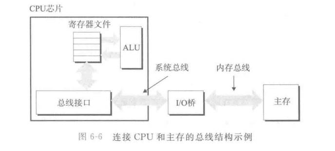
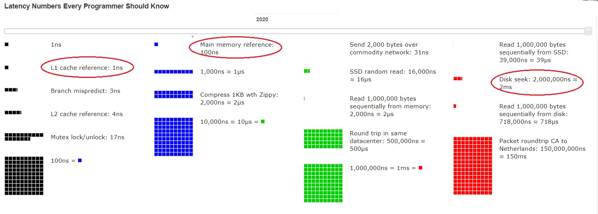
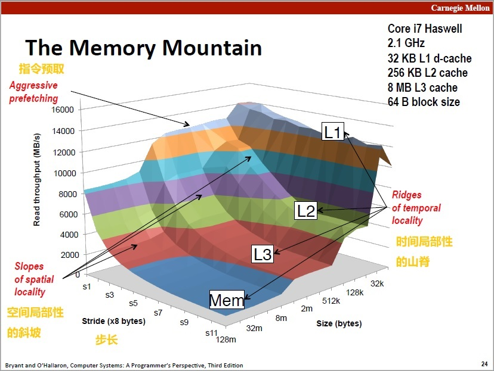

<!-- START doctoc generated TOC please keep comment here to allow auto update -->
<!-- DON'T EDIT THIS SECTION, INSTEAD RE-RUN doctoc TO UPDATE -->
**Table of Contents**  *generated with [DocToc](https://github.com/thlorenz/doctoc)*

- [第六章：存储器层次结构](#%E7%AC%AC%E5%85%AD%E7%AB%A0%E5%AD%98%E5%82%A8%E5%99%A8%E5%B1%82%E6%AC%A1%E7%BB%93%E6%9E%84)
  - [6.1 存储技术](#61-%E5%AD%98%E5%82%A8%E6%8A%80%E6%9C%AF)
    - [随机访问存储器](#%E9%9A%8F%E6%9C%BA%E8%AE%BF%E9%97%AE%E5%AD%98%E5%82%A8%E5%99%A8)
    - [磁盘存储](#%E7%A3%81%E7%9B%98%E5%AD%98%E5%82%A8)
    - [固态硬盘](#%E5%9B%BA%E6%80%81%E7%A1%AC%E7%9B%98)
    - [存储技术趋势](#%E5%AD%98%E5%82%A8%E6%8A%80%E6%9C%AF%E8%B6%8B%E5%8A%BF)
  - [6.2 局部性](#62-%E5%B1%80%E9%83%A8%E6%80%A7)
  - [6.3 存储器层次结构](#63-%E5%AD%98%E5%82%A8%E5%99%A8%E5%B1%82%E6%AC%A1%E7%BB%93%E6%9E%84)
    - [存储器层次结构中的缓存](#%E5%AD%98%E5%82%A8%E5%99%A8%E5%B1%82%E6%AC%A1%E7%BB%93%E6%9E%84%E4%B8%AD%E7%9A%84%E7%BC%93%E5%AD%98)
  - [6.4 高速缓存存储器](#64-%E9%AB%98%E9%80%9F%E7%BC%93%E5%AD%98%E5%AD%98%E5%82%A8%E5%99%A8)
  - [6.5 编写缓存友好的程序](#65-%E7%BC%96%E5%86%99%E7%BC%93%E5%AD%98%E5%8F%8B%E5%A5%BD%E7%9A%84%E7%A8%8B%E5%BA%8F)
  - [6.6 综合：高速缓存对程序的影响](#66-%E7%BB%BC%E5%90%88%E9%AB%98%E9%80%9F%E7%BC%93%E5%AD%98%E5%AF%B9%E7%A8%8B%E5%BA%8F%E7%9A%84%E5%BD%B1%E5%93%8D)
  - [6.7 小节](#67-%E5%B0%8F%E8%8A%82)
  - [补充](#%E8%A1%A5%E5%85%85)

<!-- END doctoc generated TOC please keep comment here to allow auto update -->

# 第六章：存储器层次结构

前面的讨论中，都依赖与一个简单的内存模型，即存储器系统是一个一维的线性字节数组。CPU能够在常数时间内访问每个存储器位置。这种简化是有效的，但是并不能反映现代系统的工作方式。

实际上的存储器系统是一个具有不同容量、成本和访问时间的存储设计的层次结构：
- 靠近CPU的是小的、快速的高速缓存系统（cache）。
- 缓存中的存储是相对较慢和大容量的主存中的一部分。
- 主存缓存更大更慢的磁盘上内容的一部分。
- 这些磁盘也可以作为网络连接中其他机器的缓冲区域。

存储器层次结构是可行、有效、合理的：
- 一个编写良好的程序倾向于更频繁访问某一层次的存储设备。
- 因此下一层的设备可以更慢、更大、更便宜一些。
- 最终实现整体是一个大存储池，其成本与最底层最便宜的设备相当，但却可以以接近最顶层设备的速率向程序提供数据。

## 6.1 存储技术

### 随机访问存储器

随机访问存储器（Random-Access memory）分为两类：静态（SRAM）和动态（DRAM）。
- SRAM更快也更贵，一般L1、L2、L2缓存都是用的SRAM。
- DRAM更慢也更便宜，主要用于内存。

SRAM；
- 每一位存储在一个双稳态（bitstable）的存储器单元里。
- 每个单元用一个六晶体管电路实现。可以无限期保存两个不同状态（电压）之一，其他任何状态都是不稳定的，电路会迅速转移到两个稳定状态中的一个。
- 因为是双稳态的，所以只要有电，就会永远保持它的值。

动态DRAM：
- 每个位存储为电容的电压，充满电则为1，放完电则为0。
- 每个位有一个电容和一个访问晶体管组成，集成度可以很高。
- 电容对很多因素都很敏感，会快速漏电，DRAM单元大概会在10~100毫秒内失去电荷，因为计算机运行的时间周期是以纳秒来衡量的（比如2GHz那么时钟周期就是0.5ns），相比较而言这个保持时间还是比较长的。
- 因为电容漏电，所以必须周期性读取，然后重写来刷新内存每一位，并且有些电路还有纠错码，只要错误在限度内都能够纠正回来。

SRAM和DRAM比较：
- SRAM使用6晶体管搭建，DRAM使用1晶体管加1电容。
- SRAM比DRAM快至少十倍。
- SRAM只要加电就能持续，DRAM则需要刷新。
- SRAM的每位花费大概是DRAM的一千倍。
- 这以上的特性决定了SRAM只能用于小容量的缓存，用于主存价格会非常高昂，普通消费者无法承受，也没有必要。
- 而DRAM价格低廉，虽然慢一点，耗电量大。

内存模块：
- 在64位模块中，内存以64位单位传送数据。

非易失性存储：
- SRAM和DRAM都是易失性（volatile）的，他们都是加电才能维持。
- 在掉电后依然能够维持信息的存储器被称为非易失性存储器（nonvolatile memory）。
- 由于历史原因，他们被称为ROM（Read-Only Memory），即是现在他们都是可以写的。
- PROM：可编程ROM，只能写入一次。
- EPROM：可擦写可编程ROM，需要特殊设备通过紫外线写入，可以擦写数千次。还有EEPROM：电子可擦写可编程ROM，直接印制在电路板上，可擦写次数达到10万次。
- 闪存（flash memory）：基于EEPROM，现已是非常重要的存储技术，为大量电子设备提供快速持久的非易失性存储。基于闪存的硬盘成为固态硬盘（SSD）。是一种电介质存储器，使用电信号存储单元，长时间掉电还是会有数据丢失风险（一年左右），但是只要经常通电就能够保持。
- 更传统的基于磁介质的设备：比如磁带、机械硬盘相对来说存储时间则更长。
- 存储在ROM的程序通常称为固件（fireware），当计算机运行后会运行存储在ROM中固件。

访问主存：
- 数据流通过总线（bus）在CPU和内存之间流通。
- 每次CPU和主存之间的数据通信都通过一系列步骤完成，这些步骤称为总线事务（bus transaction）。
- 读事务（read transaction）从主存传送数据到CPU，写事务（write transaction）从CPU传送数据到主存。
- 总线是一系列并行的导线，能够携带地址、数据、控制信号。取决于设计，数据和地址可能共享一组导线，也可能不。
- 多个设备可以共享同一总线。

总线：



- CPU通过内存总线连接到I/O桥，I/O桥通过系统总线连接到CPU中的总线接口。
- 其他设备也通过I/O总线连接到I/O桥。
- 在过去的真实系统中，I/O桥并不是一个统一的整体，一般会分为南桥和北桥，南桥负责通过I/O总线连接低速设备，比如鼠标、键盘等，北桥负责连接CPU、内存、显卡等，同时也连接到南桥。
- Intel从SandyBridge开始，CPU整合内存控制器和PCI-E控制器、DMI通道，相当于是把原来北桥的功能集成在CPU内部了，北桥则消失了。

### 磁盘存储

磁盘（机械硬盘）现在依然是保存大量数据的首选，虽然一定程度被SSD取代了，但是HDD单位容量价格便宜，在大型系统中依然不可或缺。
- 从磁盘上读取数据需要毫秒级时间。
- 磁盘的细节：构造、容量、操作等内容略。
- 磁盘通过I/O总线（比如PCI总线）连接到系统中，
- I/O总线虽然比系统总线和内存总线慢，但是可以容纳种类繁多的第三方I/O设备：
    - USB（Universal Serial Bus，通用串行总线）控制器：是连接到USB总线的设备的中转机构，是广泛使用标准，可以连接各种外围设备。USB总线的最大带宽在数百到上千MB/S量级（USB3.0 625MB/s, USB3.1 1250MB/s）。
    - 显卡（显示适配器）：包含硬件和软件逻辑，负责代表CPU在显示器上绘制像素。
    - 主机总线适配器：将一个或者多个磁盘连接到I/O总线，最常用的磁盘接口是SCSI和SATA（现在最常用的其实是M.2）。
- 其他设备，比如网络适配器（网卡）可以通过将适配器插入主板上空的扩展槽中，从而连接到I/O总线。
- 这里的I/O总线是一个简单的抽象，现实中它是基于PCIE总线的。
- 磁盘的典型访问速度在数百MB/s左右（一般不超过500MB/s）。

访问磁盘：
- CPU使用一种称为**内存映射**（memory-mapped I/O）的技术来向I/O设备发送命令。
- 在使用内存映射I/O的系统中，地址空间中有一块地址是为I/O设备通信保留的，每个这样的地址称为I/O端口（I/O port）。
- 当一个设备连接到总线时，它被分配（映射/关联）到一个或者多个I/O端口。
- 举个例子：
    - 当需要读取磁盘内容，CPU可能通过对端口地址的存储指令发起磁盘读取操作，通过一系列操作发送磁盘读取操作后，磁盘受到命令，通过DMA（Direct Memory Access，直接内存访问）将数据通过I/O总线和内存总线传送到内存中，而CPU在这段时间则可以执行其他操作。
    - DMA传送完成后，磁盘扇区的内容被安全存储到主存后，磁盘控制器通过给CPU发送一个中断信号来通知CPU。基本思想是中断信号会发送到CPU芯片的一个外部引脚，CPU收到后会暂停工作，跳转到一个操作系统例程，这个程序会记录下I/O已经完成，然后将控制返回到CPU被中断的地方。

### 固态硬盘

- SSD是基于闪存的存储设备，是磁盘的替代品，速度更块，价格也更贵。
- 一个SSD封装一个或者多个闪存芯片（颗粒）和闪存翻译层（主控与固件），翻译层扮演磁盘控制器相同的角色，将对逻辑块的请求翻译为对底层物理设备的访问。
- 读SSD比写更快，随机读写性能低于顺序读写。
- 现在的SSD设备速度的数百MB/S到数GB/s左右（高可至3GB/s，最低也可达数百MB/s），相比机械硬盘速度有非常大的提升。

### 存储技术趋势

- 不同的存储技术有不同的价格和性能折中。
    - 速度：SRAM > DRAM > SSD > HDD。
    - 每单位价格：SRAM > DRAM > SSD > HDD。
    - 容量则通常相反。
- 不同存储技术的价格和性能属性以不同的速率在发展：总体趋势是容量增加很快，但是访问时间降低并没有那么快。
- DRAM和磁盘性能滞后于CPU的性能：总体来说DRAM和磁盘的速度和容量的发展速度赶不上CPU性能提升的速度。
    - 特别是CPU和DRAM之间的性能差距实际上是在加大的，这主要是因为CPU发展太快了，而DRAM则没有那么快。
    - 为了弥补这一点，现代CPU中普通使用SRAM作用高速缓存，也让缓存未命中的相对代价变得越来越大。
- 不过现代CPU的提升已经没有那么显著了，CPU的发展撞上了功耗墙，时钟频率在多年前就已经增加不动了。现在CPU都是凭靠更高的指令级数据级并行度、更多的核心、更先进的制程工艺在前进。

## 6.2 局部性

一个编写良好的程序常常具有良好的局部性（locality），也就是他们倾向于引用临近与最近引用的数据项的数据项，或者最近引用过的数据项本身。
- 这种倾向性成为局部性原则，对硬件和软件系统的设计和性能都有很大影响。
- 局部性有两种形式：时间局部性（temporal locality）和空间局部性（spatial locality）。
    - 时间局部性：被引用过一次的内存位置可能在不远的将来被再次引用。
    - 空间局部性：一个内存位置被引用了一次，那么程序很可能在不远的将来引用附近的内存位置。
- 一般而言，具有良好局部性的程序比局部性差的程序运行得更快。

**对程序数据引用的局部性**：
- 看例子：
```C
int sumvec(int* v, int N)
{
    int i, sum = 0;
    for (i = 0; i < N; ++i)
    {
        sum += v[i];
    }
    return sum;
}
```
- 对于变量`sum`来说，具有良好的时间局部性，但没有空间局部性。
- 对于变量`v`来说，具有良好的空间局部性，但没有时间局部性。
- 这个函数中的变量要么具有好的时间局部性，要么具有好的空间局部性。所以我们可以断定这个函数具有良好的局部性。
- 在循环遍历连续内存时，我们称两轮循环见元素的间隔为步长，上面的`sumvec`称为步长为1的引用模式。而步长k则称之为步长为k的引用模式。
- 一般来说，步长越长。空间局部性越差。步长为1则空间局部性最好。
- 可以先到，在遍历二维数组时，因为数组按照行优先连续存储，如果行优先遍历，那么空间局部性会比较好，如果按照列优先遍历，空间局部性就会相对更差。

**对程序指令引用的局部性**：
- 除了数据，指令也会被加载到缓存中。
- 很容易想到，循环的指令引用会有比较好的空间局部性，因为循环体会被执行多次，我们可以预料到循环体的代码会一致位于缓存中，不会出现未命中的情况（当然有个前提是循环不能长到缓存装不下，或者循环中不至于执行了太多东西导致将循环体的代码替换出缓存）。
- 代码区别于数据的一个重要属性是它是运行时不能被修改的。

小结：
- 重复引用相同变量的程序具有良好的时间局部性。
- 对于步长为k的引用模式的循环，步长越小，空间局部性越好。步长为1的引用模式的程序有很好的空间局部性，在内存中跳来跳去的程序空间局部性会很差。
- 对于取指令来说，循环具有很好的时间和空间局部性。循环体越小，循环迭代次数越多，局部性越小。
- 通常来说，看一眼代码就能对程序中的局部性有清晰的认识，这是一项很重要的技能。当然想要利用局部性来优化可能并不是一个简单的事情，但是有清晰的认识之后至少指明了方向。

## 6.3 存储器层次结构

计算机的存储器层次（memory hierarchy）：

|层次|存储|典型访问速度|
|:-:|:-:|:-:|
|L0|寄存器|1个周期之内，0ns
|L1|L1缓存（SRAM）|4个周期左右，1~2ns
|L2|L2缓存（SRAM）|10个周期左右，4ns
|L3|L3缓存（SRAM）|50个周期左右，25ns
|L4|主存（DRAM）|200周期左右，50~100ns
|L5|本地二级存储（本地磁盘SSD）|100000周期左右，50us
|L6|远程二级存储<p>（分布式文件系统、WEB服务器）|取决于服务器远近，信道长度，典型在几百ms左右

- 不一定十足准确，但数量级一定是差不多的。
- 从上到下，单位容量越来越贵，通常来说容量也越来越大，速度也越来越慢。
- 三个层级缓存的典型容量举例：L1 32KB（指令数据缓存均为32KB是分开的，并且每个核心都有一份），L2 256KB（每个核心都有一份256KB），L3 8MB（所有核心共享）。
- 更多信息：[Latency Numbers Every Programmer Should Know](https://colin-scott.github.io/personal_website/research/interactive_latency.html)。



- Ulrich Drepper经典论文：[What Every Programmer Should Know About Memory](What%20Every%20Programmer%20Should%20Know%20About%20Memory.pdf)

### 存储器层次结构中的缓存

存储器层次结构的中心思想是：每一层都是下一层的缓存。
- 相邻两层之间使用约定大小的数据块（block，chunk）进行数据交换，但是不同层次之间的数据大小可能不同。
- 比如L1缓存和寄存器的数据交换大小通常是一个字，L1与L2、L2与L3、以及L3与L4的大小通常是几十字节（通常是一个缓存行长度，典型值64Bytes）。而L4与L5则可能是几十或者几千字节的块。

缓存命中状态：
- 缓存命中：上一层需要的数据恰好在下一层缓存中找到。
- 缓存未命中：上一层需要的数据没有在下一层缓存中找到，就需要再向下查找。这是需要替换这一层的缓存块，有一些典型替换策略比如LRU（最近最少使用）策略。
- 缓存未命中的种类：
    - 空的缓存：冷缓存（cold cache），强制性未命中或者冷未命中（cold miss），通常是短暂时间，比如程序刚运行时。
    - 因为缓存需要替换，因为缓存块替换而导致的未命中称为冲突未命中（conflict miss）。
    - 程序通常是按照一系列阶段（循环）来运行的，每个阶段访问缓存块的某个相对稳定不变的集合，称这个集合为这个阶段的工作集（working set）。
    - 当工作集大小超过缓存大小时，会发生容量未命中（capacity miss），换句话说就是缓存太小了，装不下整个工作集。
- 缓存管理：将缓存划分成块、在不同层之间传递块、判断缓存命中还是未命中并处理他们的工作就是缓存管理。可以是硬件、软件或者两者结合。
    - 一般来说，L1、L2、L3缓存完全由内置在缓存中的硬件逻辑管理。
    - 在有虚拟内存的系统上，内存由操作系统软件和CPU中的地址翻译硬件共同管理。
    - 分布式文件系统、网络文件系统之类则由专门的软件进程负责管理。

## 6.4 高速缓存存储器

高速缓存的实现、替换策略、组相联、全相联等内容略。

## 6.5 编写缓存友好的程序

编写高速缓存友好的程序：
- 让最常见的情况运行得快，也就是优化性能瓶颈。
- 尽量减少每个循环内部的缓存未命中数量：也就是要增强时间和空间局部性。

## 6.6 综合：高速缓存对程序的影响

一个程序从存储系统中读取数据的速率称之**读吞吐量**（read throughput），或者有时称为读带宽。通常以MB/s为单位，用来衡量程序的存储性能。在循环中，以不同步长和工作集大小作为测试，可以得到一个读带宽的时间与空间局部性的二维函数，称为**存储器山**（the memory mountain）：



- 可以看到，步长越大，空间局部性越弱，读带宽越低。
- 工作集越大，时间局部性越弱，读带宽越低。
- 当步长为1，工作集大小和L1缓存大小相当时性能最佳。
- 比较有趣的是最左侧，步长最小时因为**指令预取机制**（prefetching）的存在可以有非常高的读带宽。这是Core i7存储器系统中提供的，在小步长时会自动识别，并提前预取需要的数据到缓存中，预防了缓存失效。步长越小效果会越明显。
- 我们也可以在代码中手动进行缓存预取以提升性能，Intel的SSE指令集提供了手动预取指令：
```C
#include <mmintrinsics.h>
void _mm_prefetch(char * p , int i ); // 其中 p 是数据所在的内存地址，i 是要载入哪一个层级的Cache
```
- [GCC缓存预取相关支持的文档](https://gcc.gnu.org/projects/prefetch.html)，内建有`__builtin_prefetch `函数。

## 6.7 小节

理解存储器层次结构本质的程序员能够利用这些知识编写更高效的程序，无论存储器结构是怎么样的，推荐技术：
- 将注意力放在循环内部，大部分计算和访问发生在这里。
- 按照数据对象存储在内存中的顺序、以步长为1访问数据，使得空间局部性最大。
- 一旦存储器读入了一个数据对象，就尽可能多地使用它，从而使时间局部性最大。

总体来说，CPU缓存对程序员是透明的，所有操作和策略都是由CPU完成的，了解CPU cache的设计、原理有利于我们更好利用CPU缓存，写出缓存友好的程序。

## 补充

- 苏黎世联邦理工：[计算机体系结构](https://www.bilibili.com/video/BV1Vf4y1i7YG/)，讲了很多关于内存的东西。
- 大牛Brendan Gregg的网站：[https://www.brendangregg.com/](https://www.brendangregg.com/)，更多关于高性能编程的东西。