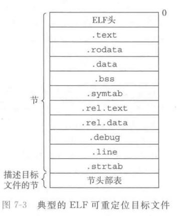
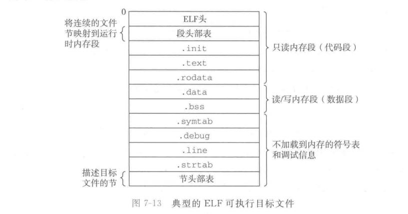
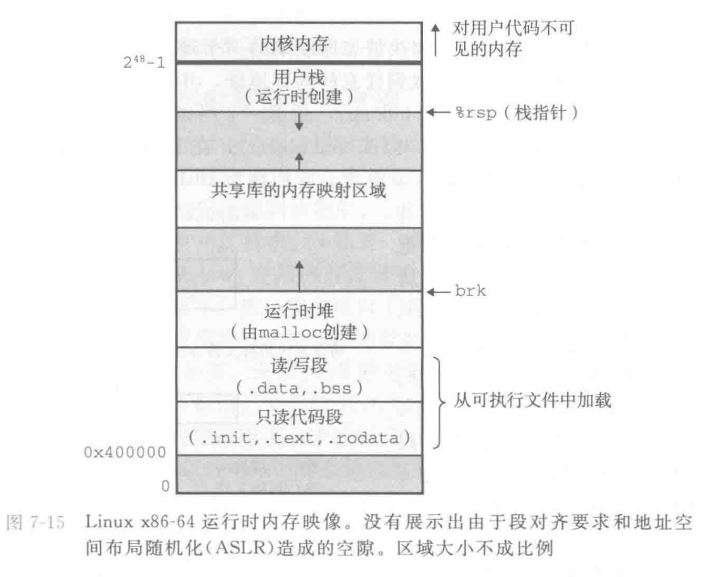
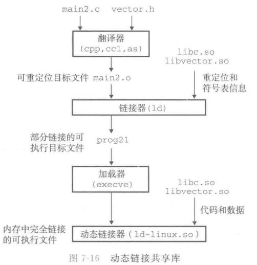

<!-- START doctoc generated TOC please keep comment here to allow auto update -->
<!-- DON'T EDIT THIS SECTION, INSTEAD RE-RUN doctoc TO UPDATE -->
**Table of Contents**  *generated with [DocToc](https://github.com/thlorenz/doctoc)*

- [第七章：链接](#%E7%AC%AC%E4%B8%83%E7%AB%A0%E9%93%BE%E6%8E%A5)
  - [7.1 编译器驱动程序](#71-%E7%BC%96%E8%AF%91%E5%99%A8%E9%A9%B1%E5%8A%A8%E7%A8%8B%E5%BA%8F)
  - [7.2 静态链接](#72-%E9%9D%99%E6%80%81%E9%93%BE%E6%8E%A5)
  - [7.3 目标文件](#73-%E7%9B%AE%E6%A0%87%E6%96%87%E4%BB%B6)
  - [7.4 可重定位目标文件](#74-%E5%8F%AF%E9%87%8D%E5%AE%9A%E4%BD%8D%E7%9B%AE%E6%A0%87%E6%96%87%E4%BB%B6)
  - [7.5 符号和符号表](#75-%E7%AC%A6%E5%8F%B7%E5%92%8C%E7%AC%A6%E5%8F%B7%E8%A1%A8)
  - [7.6 符号解析](#76-%E7%AC%A6%E5%8F%B7%E8%A7%A3%E6%9E%90)
    - [链接器如何解析多重定义的全局符号](#%E9%93%BE%E6%8E%A5%E5%99%A8%E5%A6%82%E4%BD%95%E8%A7%A3%E6%9E%90%E5%A4%9A%E9%87%8D%E5%AE%9A%E4%B9%89%E7%9A%84%E5%85%A8%E5%B1%80%E7%AC%A6%E5%8F%B7)
    - [与静态库链接](#%E4%B8%8E%E9%9D%99%E6%80%81%E5%BA%93%E9%93%BE%E6%8E%A5)
    - [链接器如何使用静态库来解析引用](#%E9%93%BE%E6%8E%A5%E5%99%A8%E5%A6%82%E4%BD%95%E4%BD%BF%E7%94%A8%E9%9D%99%E6%80%81%E5%BA%93%E6%9D%A5%E8%A7%A3%E6%9E%90%E5%BC%95%E7%94%A8)
  - [7.7 重定位](#77-%E9%87%8D%E5%AE%9A%E4%BD%8D)
    - [重定位条目（relocation entry）](#%E9%87%8D%E5%AE%9A%E4%BD%8D%E6%9D%A1%E7%9B%AErelocation-entry)
    - [重定位符号引用](#%E9%87%8D%E5%AE%9A%E4%BD%8D%E7%AC%A6%E5%8F%B7%E5%BC%95%E7%94%A8)
  - [7.8 可执行目标文件](#78-%E5%8F%AF%E6%89%A7%E8%A1%8C%E7%9B%AE%E6%A0%87%E6%96%87%E4%BB%B6)
  - [7.9 加载可执行目标文件](#79-%E5%8A%A0%E8%BD%BD%E5%8F%AF%E6%89%A7%E8%A1%8C%E7%9B%AE%E6%A0%87%E6%96%87%E4%BB%B6)
  - [7.10 动态链接共享库](#710-%E5%8A%A8%E6%80%81%E9%93%BE%E6%8E%A5%E5%85%B1%E4%BA%AB%E5%BA%93)
  - [7.11 从应用程序中加载和链接共享库](#711-%E4%BB%8E%E5%BA%94%E7%94%A8%E7%A8%8B%E5%BA%8F%E4%B8%AD%E5%8A%A0%E8%BD%BD%E5%92%8C%E9%93%BE%E6%8E%A5%E5%85%B1%E4%BA%AB%E5%BA%93)
  - [7.12 位置无关代码](#712-%E4%BD%8D%E7%BD%AE%E6%97%A0%E5%85%B3%E4%BB%A3%E7%A0%81)
  - [7.13 库打桩机制](#713-%E5%BA%93%E6%89%93%E6%A1%A9%E6%9C%BA%E5%88%B6)
    - [编译期打桩](#%E7%BC%96%E8%AF%91%E6%9C%9F%E6%89%93%E6%A1%A9)
    - [链接时打桩](#%E9%93%BE%E6%8E%A5%E6%97%B6%E6%89%93%E6%A1%A9)
    - [运行时打桩](#%E8%BF%90%E8%A1%8C%E6%97%B6%E6%89%93%E6%A1%A9)
  - [7.14 处理目标文件的工具](#714-%E5%A4%84%E7%90%86%E7%9B%AE%E6%A0%87%E6%96%87%E4%BB%B6%E7%9A%84%E5%B7%A5%E5%85%B7)
  - [7.15 小结](#715-%E5%B0%8F%E7%BB%93)
  - [补充材料](#%E8%A1%A5%E5%85%85%E6%9D%90%E6%96%99)

<!-- END doctoc generated TOC please keep comment here to allow auto update -->

# 第七章：链接

## 7.1 编译器驱动程序

大多数编译系统提供编译器驱动程序，在用户需要时调用预处理器、编译器、汇编器和链接器。
- 比如GCC：
```shell
gcc -Og -o prog main.c sum.c
```
- 这个步骤会调用预处理器`cpp`、C编译器`ccl`、汇编器`as`、链接器`ld`。
- 执行：
```shell
./prog
```
- 执行时会调用加载器（loader），将可执行目标文件的代码和数据复制到内存，然后将控制转移到这个程序开头。

## 7.2 静态链接

像ld这样的静态链接器（static linker）以一组可重定位目标文件和命令行参数作为输入，生成一个完全链接的、可以加载和运行的可执行目标文件作为输出。链接器主要完成两个任务：
- 符号解析（symbol resolution）：目标文件会定义和引用符号，每个符号对应与一个函数、一个全局变量、或者一个静态变量。符号解析的目的是将每个符号引用正好和一个符号定义联系起来。
- 重定位（relocation）：编译器和汇编器生成地址从0开始的代码和数据节。链接器通过把每个符号定义与一个内存位置关联起来，从而重定位这些节（section）。然后修改所有对这些符号的引用，使他们指向这个内存位置。链接器使用汇编器产生的重定位条目（relocation entry）的详细指令，不加甄别地执行这样的重定位。

基本事实：目标文件是字节块的集合。
- 这些块中，有的包含数据，有的包含代码，其他的则包含引导链接器和加载器的数据结构。
- 链接器将这些块连接起来，确定被连接块的运行时位置，并且修改代码和数据块的各种位置。

## 7.3 目标文件

目标文件有三种形式：
- 可重定位目标文件：包含二进制代码和数据，其形式可以在编译时与其他可重定位目标文件链接起来，创建一个可执行目标文件。
- 可执行目标文件：包含二进制代码和数据，可以直接复制到内存中执行。
- 共享目标文件：一种特殊的可重定位目标文件，可以在加载或者运行时被动态加载进内存并链接。

编译器和汇编器生成可重定位目标文件（包括共享目标文件），链接器生成可执行目标文件。

目标文件是按照特定文件格式组织的，各个系统中的目标文件都不相同：
- Windows使用可移植可执行文件（Portable Executable，PE）。
- MaxOS-X使用Mach-O格式。
- 现代x86-64 Linux和Unix使用可执行可连接格式（Executable and Linkable Format，ELF）。
- 这里集中于ELF文件格式，其他文件格式在概念上也是类似的。

## 7.4 可重定位目标文件

ELF可重定位目标文件典型格式：



- ELF头以一个16字节的序列开始，在本地64位Linux上是`7f 45 4c 46 02 01 01 00 00 00 00 00 00 00 00 00`。
- 这个序列描述了生成该文件的系统的字的大小和字节序，以及帮助链接器语法分析和解析目标文件的信息：ELF头大小、目标文件类型、机器类型、节头部表的文件偏移以及节头部表中条目的大小和数量。不同节的位置和大小是由节头部表描述的，其中目标文件中每个节都有一个固定大小的条目。
- 其中包含的信息可以通过`readelf -h`得到：
```
ELF Header:
  Magic:   7f 45 4c 46 02 01 01 00 00 00 00 00 00 00 00 00 
  Class:                             ELF64
  Data:                              2's complement, little endian
  Version:                           1 (current)
  OS/ABI:                            UNIX - System V
  ABI Version:                       0
  Type:                              REL (Relocatable file)
  Machine:                           Advanced Micro Devices X86-64
  Version:                           0x1
  Entry point address:               0x0
  Start of program headers:          0 (bytes into file)
  Start of section headers:          504 (bytes into file)
  Flags:                             0x0
  Size of this header:               64 (bytes)
  Size of program headers:           0 (bytes)
  Number of program headers:         0
  Size of section headers:           64 (bytes)
  Number of section headers:         11
  Section header string table index: 10
```
- 在ELF头和节头部表之间的都是节，一般典型的ELF可重定位文件包含下列几个节：
    - `.text`：已编译程序的机器代码。
    - `.rodata`：只读数据，比如字符串字面量，跳表等。
    - `.data`：已初始化的全局和静态C变量。
    - `.bss`：未初始化的全局和静态C变量，以及所有被初始化为0的全局或静态变量。目标文件中这个节不占据实际空间，仅仅是一个占位符，区分已初始化和未初始化是为了提供空间效率：未初始化变量不占据目标文件中的任何磁盘空间。在内存中分配时，初始化为0（通过内存映射到匿名文件初始化，见第九章）。
    - `.symtab`：符号表，存放程序中定义和引用的全局变量的信息。与编译器的符号表不同，`.symtab`不包含任何局部变量的条目。
    - `.rel.text`：一个`.text`节中位置的列表，当链接器把这个目标文件和其他文件组合时，需要修改这些设置。一般而言，任何调用外部函数或者引用全局变量的指令都需要修改。调用本地函数的指令则不需要修改。注意的是可执行目标文件并不需要重定位信息，因此通常省略。
    - `.rel.data`：被模块引用或者定义的所有全局变量的重定位信息。一般而言，任何已初始化的全局变量，如果它的初始值是一个全局变量地址或者外部定义函数的地址，都需要修改。
    - `.debug`：符号调试表，条目是程序中定义的局部变量和类型定义、程序中定义和引用的全局变量、以及原始C源文件。只有`-g`选项编译才会生成。
    - `.line`：原始C源程序中的行号与`.text`节中机器指令之间的映射。`-g`选项编译才会生成。
    - `.strtab`：一个字符串表，内容包括`.symtab .debug`节中的符号表，以及节头部中的节名字，字符串表是以null结尾的字符串序列。
- `.bss`命名起源于IBM 704汇编语言中的块存储开始（Block Storage Start）指令的首字母缩写，沿用至今。现在的话原始含义基本不具备含义，可以简记为Better Save Space。

## 7.5 符号和符号表

每个可重定位目标文件都有一个符号表，包含了其中定义和引用的符号的信息。在链接器上下文中，有三种符号：
- 该模块中定义能在其他模块定义的**全局符号**：对应于非静态的C函数和全局变量。
- 由其他模块定义并在该模块中被引用的全局符号：称为**外部符号**，对应于在其他模块定义的非静态C函数和全局变量。
- 只在该模块内部定义和引用的**局部符号**：对应于静态C函数和静态全局变量。

静态变量（static，不管是局部还是全局）不是在栈中分配而是在`.data .bss`中分配的，在符号表中会创建一个唯一的局部名称：
```C
int* p1468_f()
{
    static int x = 0;
    return &x;
}
int* p468_g()
{
    static int x = 0;
    return &x;
}
int x;
```
- 汇编：
```x86asm
p1468_f:
	movl	$x.1, %eax
	ret
p468_g:
	movl	$x.0, %eax
	ret

	.local	x.0
	.comm	x.0,4,4
	.local	x.1
	.comm	x.1,4,4
	.globl	x
	.bss
	.align 4
	.type	x, @object
	.size	x, 4
x:
	.zero	4
```
- 在不同作用域内的同名静态变量在编译后会生成不同名字的局部链接器符号`x.0 x.1`。

符号表条目中包含的信息包括：
- 符号名称：保存为在字符串表中的偏移，指向一个null结尾的字符串。
- 符号的地址：节中的相对偏移（可重定位文件中）或者绝对地址（可执行目标文件）。
- 符号类型：函数还是变量。
- 符号在哪个节：比如函数在`.text`，而变量在`.data`。
- 绑定：本地还是全局。
- 数据长度。

每个符号都被分到目标文件中的某个节：
- 有三个特殊的伪节在节头部表中没有条目：ABS表示不该被重定位的符号，UNDEF表示未定义符号，COMMON表示还未分配位置的未初始化的条目（比如`int a[]`这种吗？）。
- 可重定位目标文件才有这些伪节，可执行目标文件中没有。
- 现代版本的GCC的分配规则：
    - 未初始化的全局变量分配在`COMMON`节中，而未初始化的静态变量、初始化为0的全局或静态变量则放在`.bss`中。
- 使用`readelf -s test.o`可以读取目标文件的符号表，上面的例子中的符号表：
```
Symbol table '.symtab' contains 13 entries:
   Num:    Value          Size Type    Bind   Vis      Ndx Name
     0: 0000000000000000     0 NOTYPE  LOCAL  DEFAULT  UND 
     1: 0000000000000000     0 FILE    LOCAL  DEFAULT  ABS test.c
     2: 0000000000000000     0 SECTION LOCAL  DEFAULT    1 
     3: 0000000000000000     0 SECTION LOCAL  DEFAULT    3 
     4: 0000000000000000     0 SECTION LOCAL  DEFAULT    4 
     5: 0000000000000008     4 OBJECT  LOCAL  DEFAULT    4 x.1
     6: 0000000000000004     4 OBJECT  LOCAL  DEFAULT    4 x.0
     7: 0000000000000000     0 SECTION LOCAL  DEFAULT    6 
     8: 0000000000000000     0 SECTION LOCAL  DEFAULT    7 
     9: 0000000000000000     0 SECTION LOCAL  DEFAULT    5 
    10: 0000000000000000     6 FUNC    GLOBAL DEFAULT    1 p1468_f
    11: 0000000000000006     6 FUNC    GLOBAL DEFAULT    1 p468_g
    12: 0000000000000000     4 OBJECT  GLOBAL DEFAULT    4 x
```
- 其中`Ndx`通过索引来表示位于哪个节，只有上面的三个伪节是显式的字符串。
- `readelf -S`显式节头部表：
```
There are 12 section headers, starting at offset 0x2c0:

Section Headers:
  [Nr] Name              Type             Address           Offset
       Size              EntSize          Flags  Link  Info  Align
  [ 0]                   NULL             0000000000000000  00000000
       0000000000000000  0000000000000000           0     0     0
  [ 1] .text             PROGBITS         0000000000000000  00000040
       000000000000000c  0000000000000000  AX       0     0     1
  [ 2] .rela.text        RELA             0000000000000000  00000200
       0000000000000030  0000000000000018   I       9     1     8
  [ 3] .data             PROGBITS         0000000000000000  0000004c
       0000000000000000  0000000000000000  WA       0     0     1
  [ 4] .bss              NOBITS           0000000000000000  0000004c
       000000000000000c  0000000000000000  WA       0     0     4
  [ 5] .comment          PROGBITS         0000000000000000  0000004c
       0000000000000013  0000000000000001  MS       0     0     1
  [ 6] .note.GNU-stack   PROGBITS         0000000000000000  0000005f
       0000000000000000  0000000000000000           0     0     1
  [ 7] .eh_frame         PROGBITS         0000000000000000  00000060
       0000000000000040  0000000000000000   A       0     0     8
  [ 8] .rela.eh_frame    RELA             0000000000000000  00000230
       0000000000000030  0000000000000018   I       9     7     8
  [ 9] .symtab           SYMTAB           0000000000000000  000000a0
       0000000000000138  0000000000000018          10    10     8
  [10] .strtab           STRTAB           0000000000000000  000001d8
       0000000000000021  0000000000000000           0     0     1
  [11] .shstrtab         STRTAB           0000000000000000  00000260
       0000000000000059  0000000000000000           0     0     1
Key to Flags:
  W (write), A (alloc), X (execute), M (merge), S (strings), I (info),
  L (link order), O (extra OS processing required), G (group), T (TLS),
  C (compressed), x (unknown), o (OS specific), E (exclude),
  l (large), p (processor specific)
```

## 7.6 符号解析

局部符号：
- 链接器解析符号引用的方法就是将每个引用与他们输入的可重定位目标文件的符号表中的一个确定符号关联起来。
- 局部符号的解析相对来说比较简单，每个模块中每个局部符号只能有一个定义。
- 静态局部变量也会有本地链接符号，编译器会确保他们拥有唯一的名字。

全局符号：
- 全局符号的解析相对来说棘手很多。
- 当编译器遇到一个非当前模块定义的符号时，会假设该符号在其他模块定义，并生成一个链接器符号表条目，并把它交给链接器处理。
- 如果链接器在任何输入条目中都找不到这个符号，就输出一条错误信息并终止。
- 比如没有定义`main`函数链接器就会输出：
```
gcc test.c -o test -Wall -Wextra -pedantic-errors -Wshadow -Wno-unused-parameter -Og -DNDEBUG
/usr/bin/ld: /lib/x86_64-linux-gnu/crt1.o: in function `_start':
(.text+0x24): undefined reference to `main'
collect2: error: ld returned 1 exit status
make: [Makefile:55: test] Error 1 (ignored)
```
- 对全局符号的解析需要注意，如果多个目标文件都定义了某个符号，那么链接器可能会报错或者说选择其中一个定义抛弃其他定义，这取决于场景。

符号重整：
- C++中允许函数重载，需要将参数列表整合进函数符号名称中才能避免重名。
- 这个过程叫做符号重整（name mangling），相反的过程叫做demangling。

### 链接器如何解析多重定义的全局符号

链接器的输入是一组可重定位目标文件，每个模块定义一组符号，有些是局部的（仅对模块内可见），有些是全局的（其他模块也可见），如果多个模块中多个符号同名，那么需要特殊处理：
- 编译时，编译器向汇编器输出每个全局符号，或者是强符号（strong）或者弱符号（weak）。这个信息被编码到可重定位目标文件的符号表中。
- **函数和已初始化的全局变量是强符号，未初始化的全局变量是弱符号**。
- 根据符号强弱关系，Linux使用如下规则来处理：
    - 不允许多个同名强符号。
    - 如果有一个强符号，多个弱符号，选择强符号。
    - 如果有多个弱符号同名，选择其中任意一个。
- 这非常好理解，全局变量默认`extern`，如果初始化就成为强符号，一个全局变量不能有多个初始值，所以最多只能有一个同名强符号。不初始化就是弱符号，所有模块中都未初始化，那么随便选择一个就好，分配空间后零初始化，所有该符号都引用这个位置。
- 如果重复定义的符号类型不同，那么就是绝对的错误，可能产生很晦涩难以察觉的问题。
- 弱符号未被分配到`COMMON`段中，把决定权留给链接器。强符号则会直接分配到`.bss`中。

### 与静态库链接

现代编译器都提供机制将一组目标文件打包成一个单独的文件，称之为静态库（static library），它可以用作链接器的输入。
- 当链接器构造一个输出可执行文件时，它只复制静态库中被应用程序引用的目标模块。
- 静态库的缺点：
    - 每个可执行文件中都会重复包含静态库中的内容，浪费磁盘空间以及运行时浪费内存空间。
    - 库发生任何更改都需要更新静态库，无论改变多么小。
- 优点：
    - 相比起单独链接库中所有需要的目标文件，链接到库更加方便。
    - 链接时，程序只复制引用到的目标模块，不会把库中所有内容链接进来。
- Linux系统中，静态库是以存档（archive）的特殊文件格式存放在磁盘中的，存档文件是一组可以连接起来的可重定位目标文件的集合。有一个头部描述所有目标文件大小的大小和位置，存档文件由后缀`.a`标识。

Linux中创建静态库：
```shell
gcc -c file1.c file2.c
ar rcs libtarget.a file1.o file2.o
```
- 编译时链接静态库：
```shell
gcc -static -o exe_target filexxx.o ./libtarget.a
gcc -static -o exe_target filexxx.o -L. -ltarget
```
- 其中`-ltarget`与`./libtarget.a`等价，不过前者通过`-L`选项将库的路径显式添加到库目录，后者直接通过文件方式指定库。

### 链接器如何使用静态库来解析引用

静态库很有用，但同时可能令人迷惑。需要特别注意Linux链接器使用他们解析外部引用的方式：
- 在符号解析阶段，链接器从左到右按照他们在编译器驱动程序中出现的顺序来扫描可重定位目标文件和存档文件（静态库）。
- 在这期间，编译器会自动将`.c`翻译为`.o`文件。
- 扫描期间，链接器维护一个可重定位目标文件集合E，这个集合会合并起来形成可执行目标文件。一个未解析的符号引用（即引用了但未定义的）集合U，以及一个前面输入文件中定义的符号集合D。
- 初始时，E、U、D均为空。
- 处理过程如下：
     - 对于命令行上的每个输入文件f，链接器会判断这是一个目标文件还是存档文件。如果f是目标文件，那么链接器把f添加到E，并同时根据f修改E和D，并继续下一个文件。
     - 如果f是一个存档文件，那么链接器尝试匹配U中未解析的符号和存档文件成员定义的符号。如果某个存档文件成员m，定义了一个符号来解析U中的一个引用，就讲这个成员加入E。对存档文件所有成员执行这个过程，任何不包含在E中的目标文件成员将被简单地丢弃。并继续处理下一个文件。
     - 链接器完成命令行中对文件的扫描后，如果U非空，就会输出错误并终止。否则，就会合并和重定位E中的目标文件，构造输出的可执行目标文件。
- 以上的过程就导致了一个问题，如果将库放到前面就会导致无法解析库中的引用。所以关于库的一般准则是**将库放到命令行末尾**。
- 如果各个库相互独立（也就是说相互之间没有任何符号引用），那么他们不需要对他们进行排序。
- 如果库之间存在依赖关系，那么必须将他们按照依赖关系进行拓扑排序后，将被依赖的放在后面，依赖其他库的放在前面。
- 如果库之间存在环形依赖关系，那么可以在不同熟悉怒两次添加同一个库解决。
- 例子，如果`libx.a liby.a`相互依赖（当然这通常来说并不是好的编程习惯），那么可以这样链接：
```shell
gcc xxx.o ./libx.a ./liby.a ./libx.a
```

## 7.7 重定位

一旦链接器完成了符号解析这一步，就把代码中的每个符号引用和正好一个符号定义关联起来了。此时链接器已经知道了目标模块中的代码节和数据节的确切大小，就可以开始重定位步骤了：
- 重定位节和符号定义：
     - 首先，链接器将所有相同类型的节合并为同一类型的新的聚合节。
     - 然后链接器将运行时内存赋给聚合节，赋给输入模块定义的每个节，赋给输入模块定义的每个模块，这一步完成时，程序中每条指令和全局变量都有了唯一的运行时内存地址。
- 重定位节中的符号引用：
     - 这一步中，链接器修改代码节和数据节中对每一个符号的引用，使他们指向正确的运行时地址。
     - 执行这一步时，链接器依赖可重定位目标模块中的称为**重定位条目**（relocation entry）的数据结构。

### 重定位条目（relocation entry）

当汇编器引用一个目标模块时，它并不知道数据和代码最终放在内存什么位置。也不知道这个模块引用的任何外部定义的函数或者全局变量的位置，所以无论何时，汇编器遇到对最终位置的位置的目标引用，就会生成一个重定位条目，告诉链接器在将目标文件合并成可执行文件时如何修改这个引用。
- 代码的重定位条目放在`.rel.text`，已初始化数据的重定位条目放在`.rel.data`。
- ELF重定位条目格式：
```C
typedef struct
{
  Elf64_Addr	r_offset;		/* Address */
  Elf64_Xword	r_info;			/* Relocation type and symbol index */
  Elf64_Sxword	r_addend;		/* Addend */
} Elf64_Rela;
```
- 其中`offset`是要修改引用的节偏移，`info`被分为两个32位信息：重定位类型和用来表示符号的符号表索引，`addend`是一个符号常数，一些类型的重定位要使用它对被修改引用的值做偏移调整。
- ELF定义了32种不同的重定位类型，我们只需要关心两种：
- `R_X86_64_PC32`：重定位一个使用32位PC相对地址的引用。PC相对地址就是距PC当前运行值的偏移量。运行PC相对寻址指令时，将指令中编码的32位值加上PC当前值，得到有效地址。PC的值通常是下一条指令在内存中的地址。
- `R_X86_64_32`：重定位一个使用32位绝对地址的引用。通过绝对寻址，CPU直接使用在指令中编码的32位值作为有效地址，不需要进一步修改。
- 这两种重定位类型支持x86-64小代码模型（small code model），该模型假设可执行目标文件中的代码和数据总体大小小于2GB，可以使用32位PC相对寻址来访问。GCC默认使用小代码模型，如果要使用中代码或者大代码模型可以用`-mcmodel=medium -mcmodel=large`选项编译。

### 重定位符号引用

例子：
```C
int sum(int *a, int n);
int array[2] = {1, 2};

int main()
{
    int val = sum(array, 2);
    return val;
}
```
- 生成可重定位目标文件后反汇编：
```
Disassembly of section .text:

0000000000000000 <main>:
   0:   48 83 ec 08             sub    $0x8,%rsp
   4:   be 02 00 00 00          mov    $0x2,%esi
   9:   bf 00 00 00 00          mov    $0x0,%edi
                        a: R_X86_64_32  array
   e:   e8 00 00 00 00          callq  13 <main+0x13>
                        f: R_X86_64_PLT32       sum-0x4
  13:   48 83 c4 08             add    $0x8,%rsp
  17:   c3                      retq
```
- 关于重定位的具体细节这里不赘述。

## 7.8 可执行目标文件

ELF可执行文件结构：



- 其结构类似于可重定位目标文件，还包括了程序入口点，也就是程序运行时要执行的第一条指令。
- `.text .rodata .data`可可重定位目标文件类似，不过在可执行目标文件中，这些节已经被重定位他们最终的运行时内存地址。
- `.init`节定义了一个小函数，叫做`_init`，程序的初始化代码会调用它。
- 可执行文件是完全链接的，不再需要`rel`节。
- ELF可执行文件被设计得很容易加载到内存，可执行文件的连续的片（chunk）被映射到连续的内存段，程序头部表描述了这种关系。由`objdump -dx`得到上面的例子程序的节头部表：
```
Program Header:
    PHDR off    0x0000000000000040 vaddr 0x0000000000400040 paddr 0x0000000000400040 align 2**3
         filesz 0x0000000000000268 memsz 0x0000000000000268 flags r--
  INTERP off    0x00000000000002a8 vaddr 0x00000000004002a8 paddr 0x00000000004002a8 align 2**0
         filesz 0x000000000000001c memsz 0x000000000000001c flags r--
    LOAD off    0x0000000000000000 vaddr 0x0000000000400000 paddr 0x0000000000400000 align 2**12
         filesz 0x00000000000003f8 memsz 0x00000000000003f8 flags r--
    LOAD off    0x0000000000001000 vaddr 0x0000000000401000 paddr 0x0000000000401000 align 2**12
         filesz 0x00000000000001c5 memsz 0x00000000000001c5 flags r-x
    LOAD off    0x0000000000002000 vaddr 0x0000000000402000 paddr 0x0000000000402000 align 2**12
         filesz 0x0000000000000108 memsz 0x0000000000000108 flags r--
    LOAD off    0x0000000000002e40 vaddr 0x0000000000403e40 paddr 0x0000000000403e40 align 2**12
         filesz 0x00000000000001f0 memsz 0x00000000000001f8 flags rw-
 DYNAMIC off    0x0000000000002e50 vaddr 0x0000000000403e50 paddr 0x0000000000403e50 align 2**3
         filesz 0x00000000000001a0 memsz 0x00000000000001a0 flags rw-
    NOTE off    0x00000000000002c4 vaddr 0x00000000004002c4 paddr 0x00000000004002c4 align 2**2
         filesz 0x0000000000000020 memsz 0x0000000000000020 flags r--
EH_FRAME off    0x0000000000002004 vaddr 0x0000000000402004 paddr 0x0000000000402004 align 2**2
         filesz 0x000000000000003c memsz 0x000000000000003c flags r--
   STACK off    0x0000000000000000 vaddr 0x0000000000000000 paddr 0x0000000000000000 align 2**4
         filesz 0x0000000000000000 memsz 0x0000000000000000 flags rw-
   RELRO off    0x0000000000002e40 vaddr 0x0000000000403e40 paddr 0x0000000000403e40 align 2**0
         filesz 0x00000000000001c0 memsz 0x00000000000001c0 flags r--
```
- 包含信息：
    - `off`：目标文件中的偏移。
    - `vaddr/paddr`：内存地址。
    - `align`：对齐要求。
    - `filesz`：目标文件中段大小。
    - `memsz`：内存中段大小。
    - `flags`：运行时访问权限。

## 7.9 加载可执行目标文件

要运行可执行目标文件，可以直接在Linux Shell中输入可执行目标文件名称：
```shell
./prog
```
- 通过调用某个驻留在内存中的成为加载器的操作系统代码来运行它。
- 任何Linux程序都可以通过调用`execve`函数来调用加载器，下一章会详细介绍这个函数。
- 加载器将可执行目标文件中的代码和数据从磁盘复制到内存中，然后跳转到程序的第一条指令或者叫入口点来运行该程序。这个复制到内存并运行的过程称之为**加载**。
- 在Linux x86-64中，代码段总是从`0x400000`处开始的，后面是数据段，堆在数据段后，通过调用`malloc`向高地址生长。对后面是为共享模块保留的，用户栈从最大合法地址开始，从高地址向低地址生长。



- 栈地址从`2^48`开始，更高地址的部分是为内核代码和数据保留的，对用户代码不可见。所谓内核就是操作系统驻留在内存的部分。
- 这里为了简洁，将各个区域画得彼此相邻。实际上由于`.data`段对齐要求，代码段数据段之间是有间隙的。在分配栈、共享库、堆段内存运行时地址时，链接器还会使用地址空间布局随机化（ASLR，第三章有介绍）。
- 程序每次运行时这些区域地址都会变，但他们的相对地址是不变的。
- 执行过程：
    - 加载器将可执行文件的片（chunk）赋值到代码段和数据段之后，跳转到程序入口点，鱼就是`_start`函数地址：
    - 这个函数是系统目标文件`ctrl.o`中定义的，对所有C程序都一样。
    - 其中调用系统启动函数`__libc_start_main`，定义在`libc.so`中，它初始化执行环境，调用用户层的`main`函数，处理`main`函数返回值，然后在需要时把控制返回给内核。
- 加载过程其实是有进程、虚拟内存和内存映射的工作参与其中，见第九章。这里简要概述：
    - 简单来说，shell启动一个程序时，会启动一个子进程（`fork`），它是父进程的一个复制（COW机制），子进程通过`execve`系统调用启动加载器。
    - 加载器删除子进程现有的虚拟内存段，通过内存映射加载可执行文件的各个段（比如`.bss`、栈、堆这种就映射到匿名文件，初始化为0，其他则映射到可执行文件的具体位置）。
    - 然后跳转到`_start`。
    - 这个过程除去一些头部信息，没有显式的数据复制，直到CPU引用一个未被缓存到主存的页面中的数据时才会将页面从磁盘换入主存，才执行真正的数据或者代码复制。

## 7.10 动态链接共享库

前面接受的静态库解决了如何让大量相关函数对应用程序可用的问题，但是静态库仍然存在一些缺点。
- 静态库需要定期维护与更新，即使只更改了实现而没有更改接口，都需要重新与库进行链接。
- 而另一个问题是某些所有程序都会用到的库设施，没有必要在每个文件中保留一份，也没有必要在运行时在内存中保留多份。
- 动态库则可以解决这些问题。

共享库（shared library）是致力于解决静态库问题的现代产物：
- 共享库是一个目标模块，在运行或加载时可以加载到任意的内存地址，并和内存中的程序链接起来，这个过程称为动态链接（dynamic linking），由一个叫做动态链接器（dynamic linker）的程序来执行。
- 共享库也成为共享目标文件（shared object），Linux中常用`.so`后缀，在Winodws操作系统中则使用`.dll`（dynamic linked library，动态链接库）后缀。
- 共享库以两种不同方式来共享：
    - 对于一个库只有一个`.so`文件，所有引用该库的可执行目标文件共享这个`.so`中的代码和数据，而不是像静态库的内容那样被复制和嵌入引用他们的可执行文件中。
    - 其次，在内存中，一个共享库的`.text`节的一个副本被不同正在运行的进程共享，这是通过将共享库的物理内存同时映射到不同进程的不同虚拟内存做到的。第九章有更多细节。
- 动态链接共享库的过程：



- 链接共享库之前需要先生成共享库：
```shell
gcc -shared -fpic -o libtarget.so file1.o file2.o
```
- `-fpic`指示生成位置无关代码（position independent code），`-shared`指示链接器创建共享的目标文件。
- 链接到共享库：
```shell
gcc -o prog file1.c file2.o ./libtarget.so
```
- 动态链接时，引用的动态库中的代码不会被复制可执行目标文件中，所以在运行时就必须动态地讲动态库加载进来。者通过加载器调用动态链接器（在Linux中是`ld-linux.so`库做到这件事情）将动态库动态链接。
- 链接了动态库的可执行目标文件会将需要的动态库编码在文件中，静态执行一些链接，然后程序加载时，动态完成链接过程，没有动态库的内容真正被复制到可执行文件中。
- 动态链接的信息被保存在`.interp`节，这一节包含了动态链接器的路径名，动态链接器本身就是一个共享目标（Linux上的`ld-linux.so`）。
- 加载器不会像通常那样直接将控制传递给应用，而是加载和执行这个动态链接器，然后动态链接器执行下列的重定位完成链接任务：
    - 重定位`libc.so`（C标准库）和其他动态库的文本和数据到某个内存段（通过内存映射将动态库映射到堆和栈之间的内存区域）。
    - 重定位可执行目标文件中对所有动态库中定义的符号的引用。
- 完成后才将控制传递给应用程序，从这个时刻开始，共享库位置就固定了，在程序执行过程中不会变。

## 7.11 从应用程序中加载和链接共享库

上面介绍了的自动进行的动态链接过程，要求在链接时将动态库作为输入。但是应用程序还可以在运行过程中动态加载和链接某个共享库，而不需要在编译时将动态库链接进来：
- 这非常有用，举个例子：
    - 用户可以通过替换共享库的新版本的方式更新软件，不需要重新进行链接，不需要更新可执行目标文件。
    - 用户可以动态的加载需要的库，调用其中的函数，而不需要再`fork`和`execve`创建子进程在子进程的上下文中运行。函数会一直缓存在地址空间中，不需要创建新的上下文就可以执行特定代码，开销会降低很多，很快便能够执行。而且不需要停下机器，就可以动态添加新的功能，新的动态库。
- Linux提供的运行时动态链接接口：
```C
#include <dlfcn.h>

void *dlopen(const char *filename, int flags);

int dlclose(void *handle);

#define _GNU_SOURCE
#include <dlfcn.h>

void *dlmopen (Lmid_t lmid, const char *filename, int flags);
```
- 可通过`man dlopen`查看更详细信息。
- `dlopen`函数加载并链接动态库`filename`。
- 标志：
    - `RTLD_GLOBAL`打开将解析`filename`中的外部符号。
    - 如果当前可执行文件是`-rdynamic`编译的，那么对于符号解析而言，它的全局符号也可用。
    - 还可以包括`RTLD_NOW`和`RTLD_LAZY`其中一者，可以与到标志中，表示加载时解析对外部符号引用或者推迟直到引用库中代码时才解析符号。
- 返回一个句柄指针，加载失败则返回NULL。
- `dlsym`可以去到动态库中符号的地址：
```
NAME
       dlsym, dlvsym - obtain address of a symbol in a shared object or executable

SYNOPSIS
       #include <dlfcn.h>

       void *dlsym(void *handle, const char *symbol);

       #define _GNU_SOURCE
       #include <dlfcn.h>

       void *dlvsym(void *handle, char *symbol, char *version);
```
- `dlclose`卸载动态库。
- `dlerror`则得到最近的`dlopen dlsym dlopen`的错误信息。
```
NAME
       dlerror - obtain error diagnostic for functions in the dlopen API

SYNOPSIS
       #include <dlfcn.h>

       char *dlerror(void);
```
- 最后如果程序中使用`dlopen dlsym dlclose dlerror`加载动态库，需要添加链接选项`-ldl`，也就是说这些函数都在`libdl.so`中，需要链接进来。
- `-rdynamic`主要用于导出全局符号给动态库用，如果动态库用了可执行文件中的全局符号，那么就必须要加这个选项。不加会导致`dlopen`失败，通过`dlerror`可以获取到这个信息。
- 通过`dlopen`加载的动态库不需要特殊编译。
- 有没有部分导出符号的机制？这个导出机制和普通动态库还不一样，在编译时就链接到动态库是不需要用`-rdynamic`的。
- Windows中有一套类似机制，如`LoadLibrary`接口等。
- 例子见：[./SharedObject](./SharedObject)，执行`make run`。

Java程序中的JNI（Java Native Interface）允许Java程序调用本地的C或者C++代码，也是通过这种机制实现的。

## 7.12 位置无关代码

因为多个进程可以使用同一个库，所以必须要提供这种机制，为了避免各种问题，现代系统以这样一种方式编译共享模块的代码段，使得他们可以加载到内存中的任何位置而无须链接器修改。使用这种方法，无限多个线程可以共享一个共享模块的代码块的一个副本：
- 可以加载而无需重定位的代码称之为位置无关代码（Position-Independent Code，PIC）。
- 添加`-fpic`选项可以使GCC生成位置无关代码，共享库编译时必须总是指定该选项。
- 在x86-64系统中，对同一个模块内符号的引用是不需要特殊处理使之成为PIC的，可以用PC相对寻址来编译这些引用，构造目标文件时由静态链接器重定位。
- 然而共享模块定义的外部过程和对全局变量的引用需要一些特殊技巧。

PIC数据引用：
- 通过全局偏移量表（Global Offset Table，GOT）实现。关键思想是对全局偏移量表中条目的PC相对引用中的偏移量是一个运行时常量。

PIC函数调用：
- 通过GOT和过程链接表（Procedure Linkage Table，PLT）实现。使用延迟绑定机制，在第一次函数调用时才解析动态库中函数的地址，代价相对较大，其后的每次调用都不会再进行解析。这有效地减小了解析库中用不到的函数的开销。细节略。

## 7.13 库打桩机制

Linux链接器支持一个机制，成为库打桩（library interpositioning），允许你截获对共享库函数的调用，替换为自己的代码。
- 通过使用打桩机制，可以追踪一个特殊库函数的调用次数，验证和追踪它的输入输出值，甚至把它替换为一个完全不同的实现。
- 它的基本思想是：给定一个需要打桩的目标函数，创建一个包装函数，它的原型和目标函数完全一致。使用某种特殊的打桩机制，你可以欺骗系统调用包装函数而不是目标函数。包装函数执行自己的逻辑然后调用目标函数，并将目标函数返回值传递给调用者。
- 打桩可以发生在编译时、链接时或者程序被加载和执行的运行时。
- 以下例子对`malloc free`进行打桩。

### 编译期打桩

- 主要通过宏完成：
- 例子：
```C
// malloc.h
#define malloc(size) mymalloc(size)
#define free(p) myfree(p)
void* mymalloc(size_t size);
void myfree(void* p);
// mymalloc.c
#ifdef COMPILETIME
// implementaion of mymalloc and myfree ...
#endif

// main.c
#include <stdio.h>
#include <malloc.h>
int main()
{
    int *p = malloc(10);
    free(p);
    return 0;
}
```
- 编译：
```shell
gcc -DCOMPLETIME -c mymalloc.c
gcc -I. -o main main.c mymalloc.o
```
- 添加选项`-I.`则会进行打桩，去掉就就取消打桩。
- 就是一个简单的条件编译机制。
- 也可以使用宏作为开关，定义宏则打桩，不定义则不打桩，最后通过编译选项中的`-DXXX`作为控制。

### 链接时打桩

Linux静态链接器支持用`--wrap f`标志进行连接时打桩：
- 它把对符号`f`的引用解析为`__wrap_f`，把对符号`__real_f`的引用解析为`f`。
- 通过`-Wl,option`将选项传递给链接器，比如`-Wl,--wrap,f`。
- 例子：
```C
// myalloc.c
#ifdef LINKTIME
void* __real_malloc(size_t size);
void __real_free(void* p);
void* __wrap_malloc(size_t size)
{
    // implementation ...
}
void __wrap_free(void* p)
{
    // implementation ...
}
#endif
```
- 编译：
```shell
gcc -DLINKTIME -c myalloc.c
gcc -c main.c
gcc -Wl,--wrap,malloc -Wl,--wrap,free -o main main.o mymalloc.o
```
- 通过链接选项控制是否进行打桩，还定义了宏来控制。

### 运行时打桩

编译期打桩需要能够访问程序源代码，链接时打桩则需要能够访问程序的可重定位目标文件。不过，有这样一种打桩机制，可以在运行时打桩，只需要能够访问可执行目标文件：
- 这个机制基于动态链接器的`LD_PRELOAD`环境变量。
- 如果`LD_PRELOAD`被设置为一个共享路径名列表（以空格或者分号分隔），那么当加载和执行一个程序时，需要解析未定义引用时，动态链接器先搜索`PRE_LOAD`库，然后才搜索其他任何函库。
- 有了这个机制，当加载执行任意可执行文件时，可以对任何共享库中的任何函数打桩，包括`libc.so`。
- 例子：
```c
// mymalloc.c
#ifdef RUNTIME
#define _GNU_SOURCE
#include <stdio.h>
#include <stdlib.h>
#include <dlfcn.h>

// wrapper
void* malloc(size_t size)
{
    void* (*mallocp)(size_t size);
    mallocp = dlsym(RTLD_NEXT, "malloc"); // get malloc in libc.so
    if (!mallocp)
    {
        printf(dlerror());
        exit(1);
    }
    char* ptr = mallocp(size);
    printf("malloc(%d) = %p\n", size, ptr);
    return ptr;
}
void free(void* ptr)
{
    void (*freep)(void*) = NULL;
    if (!ptr)
        return;
    freep = dlsym(RTLD_NEXT, "free"); // get free in libc.so
    if (!freep)
    {
        printf(dlerror());
        exit(1);
    }
    free(ptr);
    printf("free(%p)\n", ptr);
}
#endif
```
```c
// main.c
#include <stdio.h>
#include <stdlib.h>

int main(int argc, char const *argv[])
{
    int *p = malloc(32);
    free(p);
    return 0;
}
```
- 编译运行：
```shell
gcc -DRUNTIME -shared -fpic -o mymalloc.so mymalloc.c -ldl
gcc -o main main.c
LD_PRELOAD="./mymalloc.so" ./main
```

## 7.14 处理目标文件的工具

Linux系统中有大量可用工具帮助理解和处理目标文件，特比是GNU binutils包中：
- `ar`：创建静态库，插入、删除、列出、提取成员。
- `strings`：列出目标文件中所有可打印字符串。
- `strip`：从目标文件中删除符号表信息。
- `mm`：列出目标文件符号表中定义的符号。
- `size`：列出目标文件中节的名称和大小。
- `readelf`：显式一个目标文件的完整结构，包括ELF头中编码的所有信息。
    - `-a`：所有。
    - `-h`：ELF头。
    - `-l`：程序头/段头部表。
    - `-S`：节头部表。
    - `-e`：`-h -l -S`，所有头。
    - `-s`：符号表。
    - `-r`：重定位表。
    - 更多见帮助。
- `objdump`：显式一个目标文件中的所有信息，最大作用是反汇编。
    - `-a`：归档文件头信息。
    - `-f`：全面的文件头信息。
    - `-h`：节头部表内容。
    - `-x`：所有头。
    - `-d`：反汇编可执行的节。
    - `-D`：反汇编所有节内容。
    - `-S`：在反汇编时混合插入源码。
    - `-s`：所有节的的全部内容。
    - `-g`：对象文件中的调试信息。
    - `-t`：符号表内容。
    - `-r`：重定位信息。
- `ldd`：列出一个可执行文件在运行时所需要的共享库。

## 补充材料

- [程序员的自我修养——链接、装载与库](https://book.douban.com/subject/3652388/)，可以作为本章的更详细的补充。
