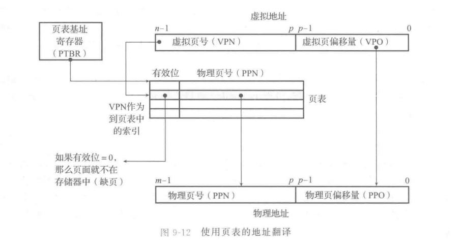
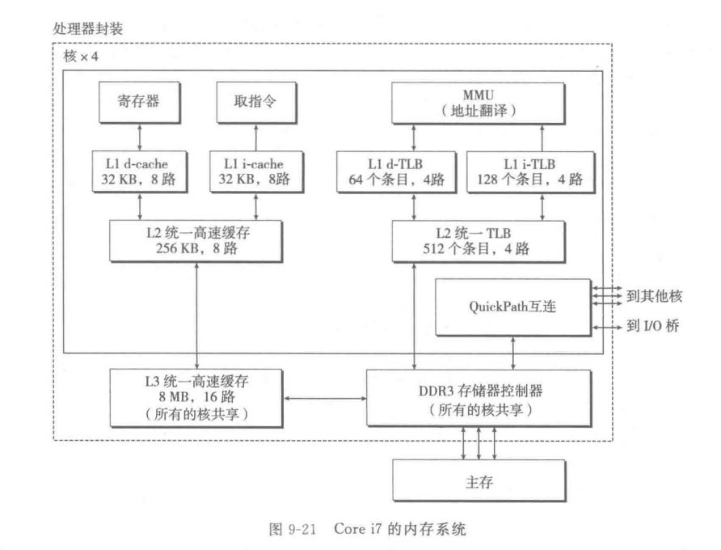
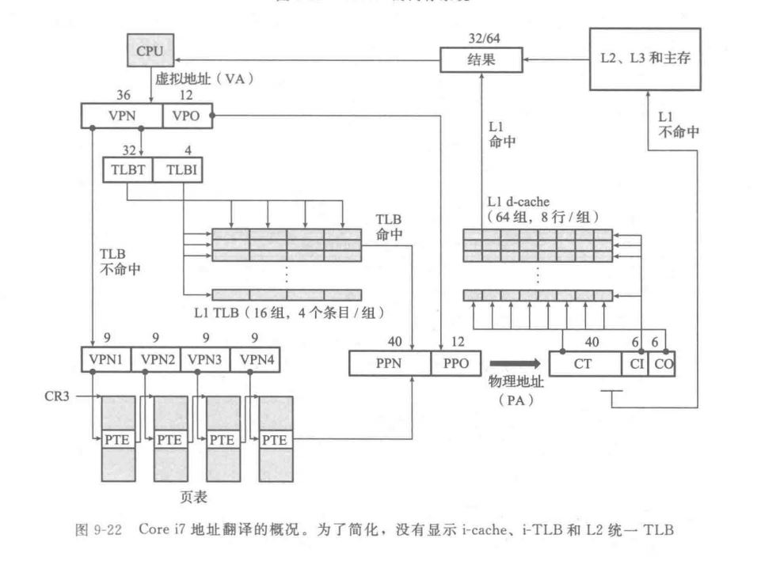
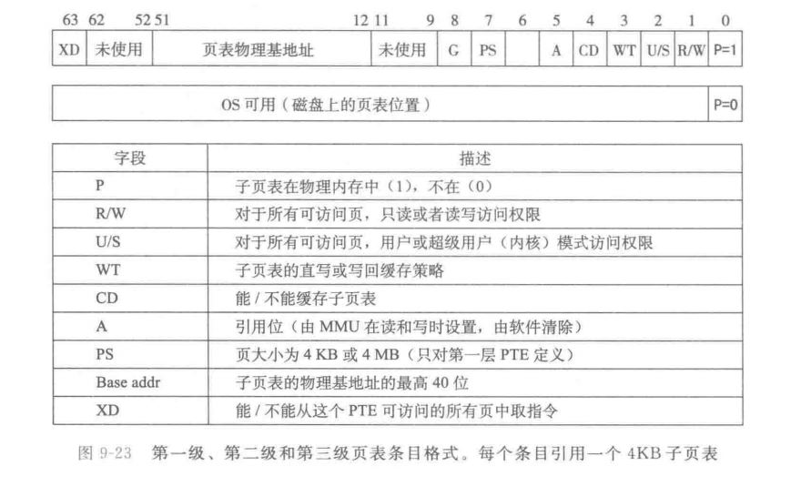
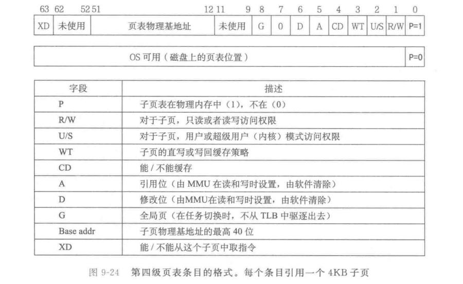
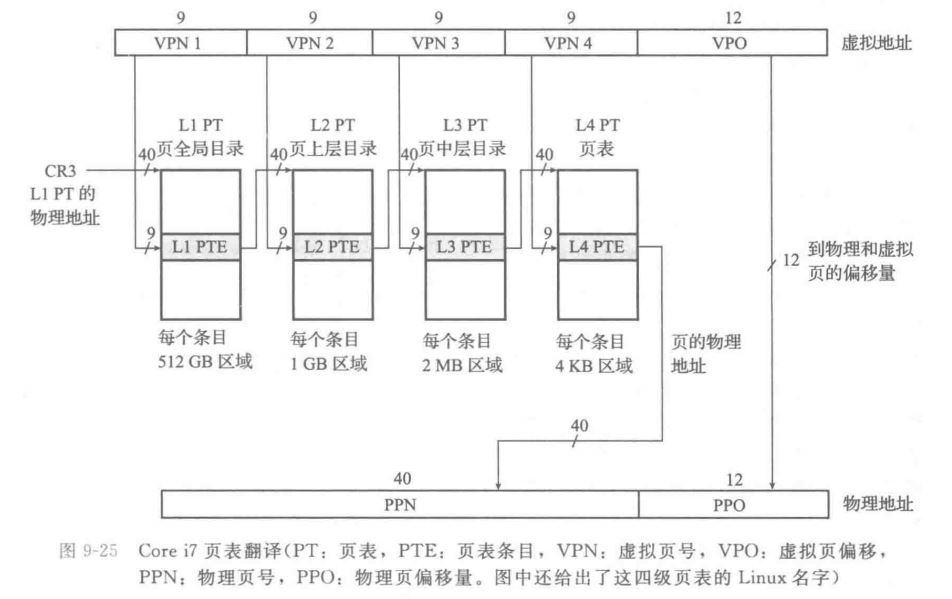
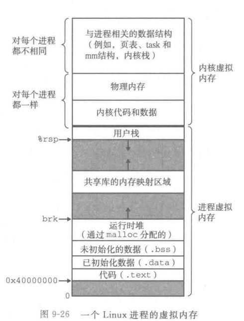
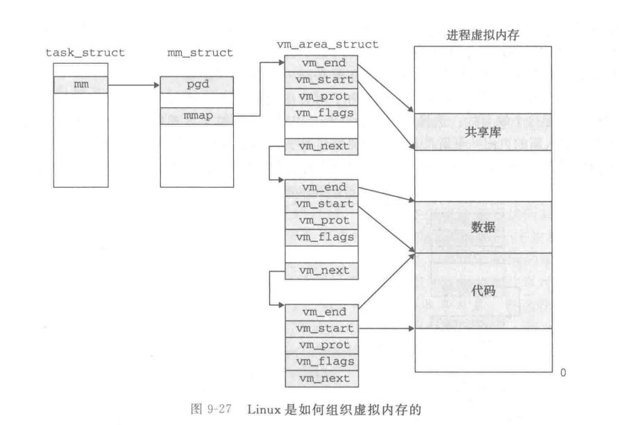
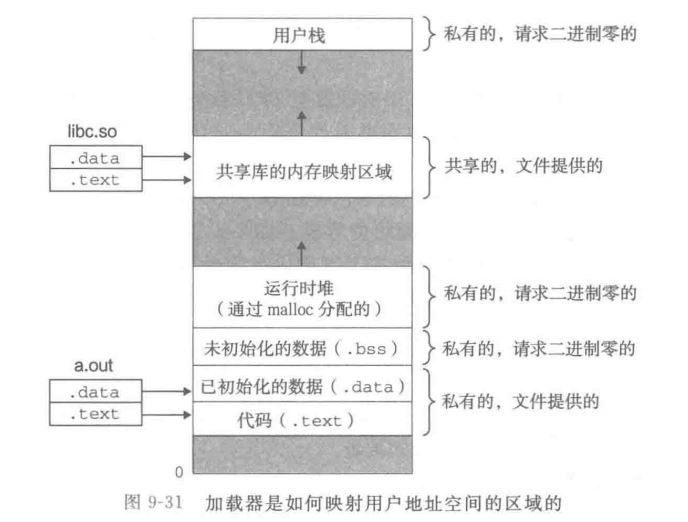

<!-- START doctoc generated TOC please keep comment here to allow auto update -->
<!-- DON'T EDIT THIS SECTION, INSTEAD RE-RUN doctoc TO UPDATE -->
**Table of Contents**  *generated with [DocToc](https://github.com/thlorenz/doctoc)*

- [第九章：虚拟内存](#%E7%AC%AC%E4%B9%9D%E7%AB%A0%E8%99%9A%E6%8B%9F%E5%86%85%E5%AD%98)
  - [9.1 物理和虚拟寻址](#91-%E7%89%A9%E7%90%86%E5%92%8C%E8%99%9A%E6%8B%9F%E5%AF%BB%E5%9D%80)
  - [9.2 地址空间](#92-%E5%9C%B0%E5%9D%80%E7%A9%BA%E9%97%B4)
  - [9.3 虚拟内存作为缓存的工具](#93-%E8%99%9A%E6%8B%9F%E5%86%85%E5%AD%98%E4%BD%9C%E4%B8%BA%E7%BC%93%E5%AD%98%E7%9A%84%E5%B7%A5%E5%85%B7)
  - [9.4 虚拟内存作为内存管理的工具](#94-%E8%99%9A%E6%8B%9F%E5%86%85%E5%AD%98%E4%BD%9C%E4%B8%BA%E5%86%85%E5%AD%98%E7%AE%A1%E7%90%86%E7%9A%84%E5%B7%A5%E5%85%B7)
  - [9.5 虚拟内存作为内存保护的工具](#95-%E8%99%9A%E6%8B%9F%E5%86%85%E5%AD%98%E4%BD%9C%E4%B8%BA%E5%86%85%E5%AD%98%E4%BF%9D%E6%8A%A4%E7%9A%84%E5%B7%A5%E5%85%B7)
  - [9.6 地址翻译](#96-%E5%9C%B0%E5%9D%80%E7%BF%BB%E8%AF%91)
  - [9.7 案例研究：Intel Core i7/Linux](#97-%E6%A1%88%E4%BE%8B%E7%A0%94%E7%A9%B6intel-core-i7linux)
    - [Intel Core i7地址翻译](#intel-core-i7%E5%9C%B0%E5%9D%80%E7%BF%BB%E8%AF%91)
    - [Linux虚拟内存系统](#linux%E8%99%9A%E6%8B%9F%E5%86%85%E5%AD%98%E7%B3%BB%E7%BB%9F)
  - [9.8 内存映射](#98-%E5%86%85%E5%AD%98%E6%98%A0%E5%B0%84)
    - [共享对象](#%E5%85%B1%E4%BA%AB%E5%AF%B9%E8%B1%A1)
    - [fork](#fork)
    - [execve](#execve)
    - [使用mmap的用户级内存映射](#%E4%BD%BF%E7%94%A8mmap%E7%9A%84%E7%94%A8%E6%88%B7%E7%BA%A7%E5%86%85%E5%AD%98%E6%98%A0%E5%B0%84)
  - [9.9 动态内存分配](#99-%E5%8A%A8%E6%80%81%E5%86%85%E5%AD%98%E5%88%86%E9%85%8D)
  - [9.10 垃圾收集](#910-%E5%9E%83%E5%9C%BE%E6%94%B6%E9%9B%86)
  - [9.11 C程序中常见的与内存相关的错误](#911-c%E7%A8%8B%E5%BA%8F%E4%B8%AD%E5%B8%B8%E8%A7%81%E7%9A%84%E4%B8%8E%E5%86%85%E5%AD%98%E7%9B%B8%E5%85%B3%E7%9A%84%E9%94%99%E8%AF%AF)

<!-- END doctoc generated TOC please keep comment here to allow auto update -->

# 第九章：虚拟内存

为了更有效地隔离进程的内存空间，防止一个进程不小心使用进程的另一个的内存，现代的系统提供了一种对主存的抽象概念，叫做虚拟内存（virtual memory）。
- 虚拟内存是硬件异常、硬件地址翻译、主存、磁盘文件和系统内核软件的完美交互，它为每一个进程提供了一个大的、一致的和私有的地址空间。
- 它提供了三个能力：
    - 将主存看做一个存储在磁盘上的地址空间的高速缓存，在主存中只保存活动区域，并根据需要在磁盘和主存之间来回传递数据，通过这种方式，更高效地使用了主存。
    - 为每个进程提供了一致的地址空间，简化了内存管理。
    - 保护每个进程的地址空间不被其他进程破坏。


虚拟内存是计算机系统中最重要的概念之一，它是对程序员透明、自动工作的，不需要程序员的任何干涉，我们基于以下原因需要关心它：
- 虚拟内存是核心的：虚拟内存在计算机系统的所有层面，在硬件异常、汇编器、链接器、加载器、共享对象、文件和进程的设计中扮演重要角色。
- 虚拟内存很强大：虚拟内存给与程序强大的能力，可以创建和销毁内存片（chunk）、将内存片映射到磁盘文件的某个部分，以及与其他进程共享内存。
- 虚拟内存是危险的：当应用程序引用一个变量、间接引用一个指针或者调用malloc这样的动态分配程序时，就会和虚拟内存进行交互。引用的了错误的内存可能导致段错误。

本章主要包含两部分：理解虚拟内存如何工作，使用和管理虚拟内存。后者建立在前者基础之上。

## 9.1 物理和虚拟寻址

计算机的主存是一个由M个连续自己大小的单元组成的数组，每个字节都可以通过唯一的**物理地址**访问。

- 当CPU执行加载指令时，会生成一个物理地址，通过内存总线传递给主存。
- 早期的PC使用物理寻址，现在诸如数字信号发生器、嵌入式微控制器之类的系统还会使用这种寻址方式。
- 然而，现代处理器都使用一种叫做虚拟寻址（virtual addressing）的寻址方式。
- CPU通过生成一个虚拟地址来访问主存，在访问之前，会由CPU中的内存管理单元（MMU）先将虚拟地址转换成一个物理地址，这个任务叫做地址翻译。
- 内存管理单元是CPU上的一个专用硬件，利用存放在主存中的查询表动态翻译虚拟地址，这个表的内容由操作系统管理。

## 9.2 地址空间

地址空间是线性的，物理地址空间就是从0到最大物理地址，而现代计算机系统的虚拟地址空间则支持32位或者64位，在64位系统上，虚拟地址空间就是64位的。

主存中的每一个字节都有一个物理地址和虚拟地址。

## 9.3 虚拟内存作为缓存的工具

虚拟内存：
- 概念上来说，虚拟内存被组织为一个存放在磁盘上的N个连续字节大小的单元组成的数组。每个字节都有一个唯一的虚拟地址，作为索引。
- 和其他层次一样，虚拟内存被分割为块，这个块被称为虚拟也（virutal page，VP），每个虚拟页的大小为`2^p`字节。
- 类似地，物理内存被分隔为物理页（physical page，PP），作为虚拟内存的缓存，大小和虚拟页大小相同，也被称为页帧。
- 在任意时刻，虚拟页面的集合被分为三个不相交的子集：
    - 未分配的：虚拟内存系统还未分配这个页，和任何数据无关联，不占用任何磁盘空间。
    - 已缓存的：已缓存在物理内存中的已分配页。
    - 为缓存的：未缓存在物理内存中的已分配页。

DRAM缓存的组织结构：
- DRAM比SRAM大约慢10倍，而磁盘比DRAM大约慢100000倍。因为DRAM缓存未命中比SRAM缓存未命中昂贵得多。
- 因为非常大的未命中惩罚，虚拟页往往很大，通常是4KB~2MB。
- 因为惩罚很大，所以替换策略也很重要，替换错了虚拟页的惩罚也很高。DRAM缓存替换算法通常更复杂精密。DRAM总是使用写回而不是直写。

页表：
- 同任何缓存一样，虚拟内存系统需要有某种方法判断一个虚拟页是否缓存在DRAM中的某个地方。
- 系统还需要确定这个虚拟页存放在哪个物理页中。如果未命中，系统需要判断这个虚拟页放在磁盘什么位置。
- 这些功能由软硬件联合提供，包括操作系统、MMU（内存管理单元）的地址翻译硬件、和一个存放在物理内存中的叫做**页表**（page table）的数据结构。
- 页表将虚拟页映射到物理页，每次地址翻译硬件将一个虚拟地址转换为物理地址时，都会读取页表。操作系统负责维护页表内容，以及在磁盘和DRAM之间传送页。
- 页表是一个页表项（page table entry，PTE）的数组，虚拟地址空间中每个页都对应一个页表项，页表项中保存着页是否有效（也就是是否在DRAM中），以及物理页号或者磁盘地址（如果为空则表示这个虚拟页还未分配）。

页命中：
- 当CPU有了虚拟地址需要读取其中的数据时，地址翻译硬件（MMU）先将地址作为一个索引用来定位其PTE，并从内存中读取它得到物理页的起始物理地址，然后构造出数据的物理内存。

缺页：
- DRAM缓存未命中被称之为缺页（page fault）。
- 此时MMU从页表项有效位推出页面未被缓存的信息，并且触发一个缺页异常。
- 缺页异常触发后会调用内核中的缺页异常处理程序，该程序会选择一个牺牲页，如果这个牺牲页相教磁盘中被修改了，那么会被复制回磁盘，然后内核将需要的页从磁盘中复制到DRAM中牺牲页的位置。
- 然后异常处理程序返回，此时会重新启动导致缺页的指令。
- 虚拟内存是20世纪60年代发明的，远在SRAM缓存之前。按照虚拟内存中的习惯，块被称为页，在磁盘和内存之间传送页的活动叫做**交换**（swapping）或者**页面调度**（paging）。
- 页从磁盘**换入**DRAM或者从DRAM**换出**到磁盘。
- 直到DRAM页面未命中时，才换入页面的策略成为**按需页面调度**（demand paging）。也可以采用其他方法，尝试预测未命中，在页面实际需要前就换入页面。
- 所有现代操作系统都采用按需页面调度的方式。

分配页面：当分配一个新页面时（比如调用`malloc`），内核在磁盘上创建一个新虚拟页。

局部性：
- 我们可能会担心磁盘和DRAM的巨大性能差距是否会导致虚拟内存的效率低下，未命中惩罚代价过大，担心页面调度破坏程序性能。
- 实际上，虚拟内存机制工作得相当好，这主要归功于局部性（locality）。
- 尽管整个运行过程中程序引用的不同页面总数可能超过物理内存的总大小，但是局部性原理保证了在任意时刻，程序将趋向于在一个较小的活动页面（active page）集合上工作，这个集合成为工作集（working set）或者常驻集合（resident set）。
- 只要我们的程序有良好的时间局部性，虚拟内存系统就能工作得相当好。
- 当然不是所有程序都能有良好的时间局部性，如果工作集超出了物理内存大小，就可能发生抖动（thrashing），这时页面将不断换入换出，导致性能大幅降低。
- Linux系统中可以通过`getrusage`函数监测缺页数量。

## 9.4 虚拟内存作为内存管理的工具

- 前面提到的页表其实是每个进程一个，每个进程的虚拟地址空间都是独立的。
- 多个进程可以将不同进程中的虚拟页面映射到同一个**共享物理页面**。
- 按需页面调度和独立的虚拟地址空间结合，对系统中内存的使用和管理产生了深远的影响。
- 特别是虚拟内存简化了加载、代码和数据共享，以及应用程序的内存分配过程：
    - **简化链接**：独立的地址空间允许每个进程的内存映象使用相同的基本格式，而不管代码和数据实际存放在物理内存的何处。
        - 例如64位Linux中，代码段地址总是从虚拟地址0x400000开始，数据段在代码段之后，栈在用户空间最高地址的部分，向低地址生长。
        - 这样的一致性简化了链接器的设计和实现，允许链接器生成完全可链接的可执行文件，这些可执行文件是独立于物理地址中代码和数据的最终位置的。
    - **简化加载**：虚拟内存还使得容易向内存中加载可执行文件和共享目标文件。加载器不需要向内存复制数据，在CPU取指令或者引用内存位置时会自动有虚拟内存系统将页面调入。
        - 将一组连续的虚拟页映射到任意一个文件中的任意位置的表示法叫做**内存映射**（memory mapping）。Linux提供一个`mmap`的系统调用，允许应用程序自己做内存映射。
    - **简化共享**：独立地址空间为操作系统提供了一个管理用户进程和操作系统自身之间的共享的一致机制。
    - **简化内存分配**：分配内存时（比如`malloc`），操作系统分配适当的连续的虚拟内存页面，并将其映射到任意位置的（物理页面不必连续）的物理页面。

## 9.5 虚拟内存作为内存保护的工具

任何现代操作系统都必须为操作系统提供手段来控制对内存的访问：
- 不应该允许用户修改他的只读代码段。
- 不应该允许用户读取或者修改任何内核中的代码或者数据结构（要修改必须通过系统调用）。
- 不应该允许用户读或者写其他进程的私有内存，不应该允许修改与其他进程共享的虚拟页面，除非共享者显式允许这么做。
- 要提供这些机制很简单：
    - 在PTE中添加一些额外的位来标志进程是否必须运行在内核态才能访问（即通过系统调用才能修改）、是否能够读取、能够写入。
    - 通过加入SUP、READ、WRITE三个位就能控制对内存的访问了。
- 如果一条指令违背了这些许可条件，那么CPU就会触发一个保护屏障，将控制传递给内核中的异常处理程序。在Linux Shell中一般将这种异常报告为**段错误**（segment fault）。

## 9.6 地址翻译

形式上来说，地址翻译是一个将一个N（`2^n`）元素的虚拟地址空间（VAS）映射到一个M（`2^m`）元素的物理地址空间（PAS）的过程：
- 虚拟地址n位，其中虚拟页偏移量（VPO）p位，页面大小为`2^p`，虚拟页号（VPN）n-p位。
- 物理地址m位，其中物理页偏移量（PPO）p位，页面大小为`2^p`，物理页号（PPN）m-p位。
- CPU中有一个控制寄存器——页表基址寄存器（PTBR）指向当前（进程的）页表。
- 通过n-p位虚拟页号作为页表索引，找到当前要查找的内存的页表项（PTE），页表命中的情况下，从中提取出m-p位物理页号，拼接p位物理页偏移量（也即是虚拟页偏移量）后得到m位物理地址，然后使用物理地址访存。



- 页面命中时，CPU硬件执行步骤：
    - 处理器生成虚拟地址，传送给MMU。
    - MMU生成PTE地址，并传送给缓存/主存得到PTE。
    - MMU通过PTE中的物理页号构造出物理地址，并传送给缓存/主存得到请求的数据。
- 缺页时，则需要操作系统内核和硬件协作完成：
    - 第二步后，得到PTE地址，PTE地址中有效位为0，MMU触发缺页异常，传递CPU控制到操作系统内核中的缺页异常处理程序。
    - 缺页处理程序确定物理内存中的牺牲页，将其换出到磁盘。
    - 缺页处理程序调入新的页面，更新内存中的PTE。
    - 缺页处理程序返回到原来的进程，再次执行导致缺页的指令，CPU将虚拟地址重新发送给MMU。

结合高速缓存与虚拟内存：
- 在既使用虚拟内存又使用SRAM高速缓存的系统中，都有应该使用虚拟地址还是物理地址来访问SRAM的问题。
- 大多数系统都是使用物理地址的。
- 使用物理地址，多个进程都在缓存中有存储块、共享来自相同虚拟页面的块是非常简单的事情。而且高速缓存无需额外保护处理，因为访问权限检查是地址保护的一部分。

利用TLB加速地址翻译：
- CPU每产生一个虚拟地址，MMU都需要查阅一个PTE，以将虚拟地址翻译为物理地址。
- 在最糟糕的情况下，所有缓存都未命中，这要求从内存中多取一次数据，代价将高达几十到几百个时钟周期。
- 即使PTE缓存在L1缓存缓存中，也会有几个时钟周期的开销。
- 许多系统识图消除这种开销，都在MMU中继承了一个PTE的缓存，称为**快表**（Translation Lookaside Buffer，**TLB**，转换查找表）。
- TLB是一个小的，虚拟寻址的缓存，其中每一行保存着一个由单个PTE组成的块，TLB通常都有高度的相连度。
- 用于组选择和行选择的TLB索引和TLB标记是从虚拟地址的虚拟页号中提取出来的。TLB索引是虚拟页号中低t位组成，而TLB标记是VPN中剩余位组成。
- 当TLB命中时，MMU可以在一个时钟周期之内从TLB中取出PTE。
- 当TLB未命中时，需要从L1缓存中取出PTE，新取出的PTE将被缓存到TLB，可能会覆盖一个条目。

多级页表：
- 即使在32位系统、4KB的页面大小、4字节的PTE情况下，对于每个线程我们将需要4MB的大小才能够存下整个页表。相对来说代价是比较大的。
- 对于64位来说，情况将更复杂。
- 所以需要将页表进行压缩，最常用的手段是使用多级层次结构的页表。
- 比如，每个一级页表PTE管理4MB的虚拟内存，其中保存二级页表地址，二级页表中保存1024个PTE，每个PTE映射一个4KB的页面。
- 这种方法从两个方面减少了内存需求：
    - 如果一级页表中PTE为空（未分配），那么对应二级页表根本就不会存在。对于一个普通程序来说，大部分地址空间都是未分配，这是一种巨大的节约。
    - 第二，只有一级页表才需要总是在主存中，虚拟内存系统可以在需要时创建、页面调入或者调出二级页表。这样减小了主存的压力，只有最常使用的二级页表才需要缓存在主存中。
- 对于k级页表层次结构的地址翻译来说，将虚拟页号分割成k个部分，每个部分用来所以相应层级的页表。
- 在确定PPN前，MMU必须访问k个所有层次的PTE。
- 看起来访问k次PTE会非常昂贵，但是MMU中的TLB在这里会起作用。通过将不同层次上的页表PTE缓存起来，实际上，带多级页表的地址翻译并不比单级页表慢很多。

## 9.7 案例研究：Intel Core i7/Linux

### Intel Core i7地址翻译

Intel Core i7的一些参数：
- 64位虚拟和物理地址空间，现在的实现支持最高48位有效虚拟地址空间（更高位不会用都是0，256TB）和52位物理地址空间（4PB）。
- 处理器封装4个核心，所有核心共享的大的8MB L3缓存和一个内存控制器。
- 有一组QuickPath的点到点链路，在每个核心内部，基于QuickPath技术，为了让一个核心与其他核心和外部I/O桥直接通信。
- 每个核心内部有独立的32KB数据和32KB指令L1缓存，以及256KB统一L2缓存。
- 每个核心内部有一个MMU，其下有着一个64条目的L1数据TLB，和128条目的L2指令TLB，以及一个统一的512条目的L2 TLB。
- L1、L2、L3缓存是物理寻址，分别是8路、8路、16路组相联。L1、L2 TLB都是4路组相联。
- 页面大小可以在启动时配置为4KB或者4MB，Linux使用4KB的页。



Core i7地址翻译：
- Core i7使用4级页表层次，每个进程都有自己的私有页表层次结构。
- 当一个Linux进程运行时，虽然core i7允许页表换入换出，但是与已分配的页关联的页表都是常驻内存的。
- CR3控制寄存器指向一级页表的起始位置，作为进程上下文的一部分，在上下文切换时，会被保存和恢复。



PTE:
- core i7使用四级页表。
- 每一级页表项都是9位寻址，512个PTE，每个PTE 8个字节，所以每一级页表都是4KB。
- 并且要求每个物理页表都4KB对齐，也就是每个物理页表刚好占据一个物理页，而不会跨两个物理页。
- 第一二三级页表项如下：



- 最后一位是有效位，表示位于内存还是磁盘。
- 如果位于内存，则有40位物理页号，其他都是权限位或者策略。
- 如果位于磁盘，则除去最后一位后都表示磁盘上的页表位置。
- 在Linux中，运行着的进程的页表的有效位总是1。
- 第四级页表项如下：



权限位：
- PTE中有三个权限位：
    - R/W确定页是可以读写还是只读。
    - U/S确定是否能够在用户态访问，从而保护内核代码和数据。
    - XD（禁止执行）是64位系统引入，用来禁止从某些内存页取指令，这是一个重要特性，通过限制只能执行只读代码段，使得操作系统内核降低了缓冲区溢出攻击的风险。

Core i7MMU使用四级页表来翻译虚拟地址到物理地址的过程：



### Linux虚拟内存系统

这里只是做一个大致描述，并非全面细致的讨论细节。了解实际操作系统如何组织虚拟内存，以及如何处理缺页的。

Linux为每个进程维护了一个单独的虚拟地址空间，其结构如图：



- 其中比栈地址更高的一部分被映射为内核中所有进程共享的物理页面。

Linux虚拟内存区域：
- Linux将虚拟内存组织为一些区域（area）的集合，一个区域是已经分配的虚拟内存的连续片（chunk）。
- 每个已分配的虚拟页面都保存在某个区域中，而不属于某个区域的虚拟页是不存在的，并且不能被进程引用。
- 区域的概念很重要，它允许虚拟地址空间存在间隙，内核不用记录不存在的虚拟页，这样的页也不用占用内存、磁盘或者内核本身的任何额外资源。
- Linux内核中用于管理进程虚拟地址空间的结构是任务结构`task_struct`，其中包含了内核运行该进程所需要的所有信息：PID、指向用户栈的指针、可执行目标文件名字、程序计数器、页表地址等。
- 其中保存的`mm_struct`描述了虚拟内存的状态：



- `pgd`中是第一级页表的基址（首地址）。

Linux缺页异常处理：
- 当MMU试图访问虚拟地址A时，触发了一个缺页，这个异常导致转到内核的缺页处理程序，然后执行下列步骤：
- 判断地址是否合法，会遍历这个区域结构链表，如果在链表中，那么合法，如果不在，那么就是引用一个不存在的页中内存，会报**段错误**。
- 如果这个页面存在，那么会判断权限是否合法，比如执行写内存指令就需要对该内存有写权限，取内存中指令执行那么就必须有执行权限。如果权限不够，那么会触发一个保护异常，终止程序。
- 如果页面存在且有权限，那么就正常处理缺页，选择一个牺牲页面，并换入缺了的那个页面。返回CPU会重新启动引起缺页的指令，这条指令将A再次发到MMU，这次就不会缺页中断了。

## 9.8 内存映射

Linux中，通过将虚拟内存区域与磁盘上的一个对象关联起来，以初始化这个虚拟内存区域的内容，这个过程称之为内存映射（memory mapping）。虚拟内存可以映射到两种文件之一：
- **Linux文件系统中的普通文件**：因为按需页面调度，直到CPU第一次引用这个页面才会将文件内容加载到主存中。如果区域比文件大，那么用0填充剩余部分。
- **匿名文件**：一个区域可以映射到一个匿名文件，匿名文件是由内核创建的，包含的二进制全0，CPU第一次引用这个页面时，内核会在物理内存中找一个合适的牺牲页面（如果这个页面修改过，会将其换出到磁盘），然后用二进制0覆盖牺牲页面并更新页表。注意此时其实磁盘和主存没有实际的数据传送。因为这个原因，映射到匿名文件区域的页面也叫请求二进制零的页（demand-zero page）。
- 无论哪种情况，一旦虚拟页面初始化，它就在一个有内核维护的专门的交换文件（swap file）之间换来换去。交换文件也成为交换空间（swap space）或者交换区域（swap area）。

### 共享对象

某些对象会在多个进程中使用（比如C标准库中的函数），内存映射为我们提供了一种共享对象的清晰机制：
- 一个对象可以被映射到虚拟内存的一个区域，要么作为共享对象，要么作为私有对象。
- 共享对象：映射共享对象的区域称之为共享区域，对共享区域的更改对其他共享了该对象的线程可见。
- 私有对象：私有对象实现了写时复制（Copy-on-write）功能，修改对其他线程不可见，并且在写时才会复制。
- 私有对象写时复制的实现：将页面标记为只读，并且区域结构被标记为**私有的写时复制**，写页面内的内存会触发内核的异常保护程序，此时复制区域到新页面，并恢复页面的可写权限，并返回这个写操作的执行位置重新执行。

### fork

fork函数被当前进程调用时，内核为新进程创建各种数据结构，并分配一个唯一的PID。
- 为了创建新进程的虚拟内存，它创建当前进程的`mm_struct`、区域结构、页表的副本，并将两个进程的所有页面标记为只读，每个区域结构标记为私有的写时复制。
- 当两个进程中的某个进行写操作时，进行写时复制创建并复制新页面。

### execve

虚拟内存和内存映射在将程序加载到内存中的过程中也扮演重要角色：
- 以`execve("a.out", NULL, NULL)`为例，`execve`在当前进程中加载并运行包含在可执行目标程序`a.out`中的程序，用`a.out`程序代替当前程序。
- 执行步骤：
    - 删除已存在的用户区域。
    - 映射私有区域：为新程序的代码、数据、bss、栈区域创建新的区域结构。这些区域都是私有、写时复制的。其中bss区域、栈、堆是请求二进制0的，映射到匿名文件。
    - 映射共享区域，映射到用户虚拟地址空间的共享区域内。
    - 设置程序计数器PC为代码区域的入口点。
- 示意图：



### 使用mmap的用户级内存映射

```C
#include <sys/mman.h>
void *mmap(void *addr, size_t length, int prot, int flags,
           int fd, off_t offset);
int munmap(void *addr, size_t length);
```
- 通过`mmap`可以将文件`fd`中`offset`偏移处开始，连续对象片大小为`length`，最好从地址`addr`开始。
- `prot`为权限：执行、可读、可写、不能访问。
- `flags`为对象类型标记：匿名对象（请求二进制0）、私有写时复制、共享对象。
- `munmap`删除虚拟内存区域。

## 9.9 动态内存分配

使用`mmap munmap`函数可以创建和删除虚拟内存区域，但是一般来说对于C程序员，使用动态内存分配器会更方便更有移植性。
- 分配器有两种风格：
    - 显式：C的`malloc free`，C++的`operator new/delete`。
    - 隐式：要求分配器检测已分配的块不再被使用时自动回收，隐式分配器也叫垃圾收集器（garbage collector）。
- 大多数程序依赖显式的内存分配器，而不是直接使用内存映射等底层虚拟内存管理机制。

至于实现动态内存分配，暂略。

## 9.10 垃圾收集

略。

## 9.11 C程序中常见的与内存相关的错误

常见内存错误：
- 间接引用坏指针：将非指针数据当做指针引用。
- 读取未初始化内存：比如堆内存。
- 栈缓冲区溢出：栈中缓冲区长度有限，越界写缓冲区导致栈数据损坏。
- 假设指针和他们指向的对象大小相等：可能正常工作，但不可移植，大多是笔误。
- 错位错误：越界写数组写坏了其他数据。
- 误解指针运算：指针的算术运算有自己的规则。
- 引用不存在变量：比如返回局部对象指针，这个指针可能可以读写，但是并非想要的对象，可能写坏栈。
- 引用空闲堆数据：引用已经释放的堆中数据。
- 内存泄漏：内存分配后未释放。
